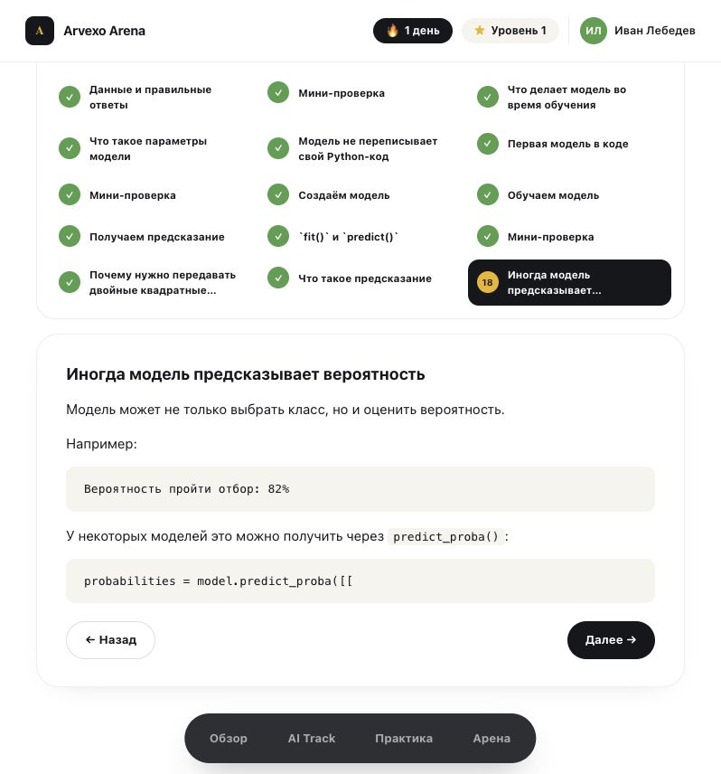

# Аудит курсов Arvexo Olympiad Arena

Дата: 18 июля 2026 года  
Проверенная версия: https://arena.arvexo.ru  
Режим: авторизованный пользователь, desktop и мобильный viewport 390×844.

## Охват

В продакшене фактически опубликован один трек — **AI Track**. В нём заявлено 14 уроков. Полностью доступны для чтения первые три урока; следующие 11 показаны в карте, но заблокированы. Ещё шесть разделов отображаются как `0/0`, то есть без уроков. Поэтому содержательно полностью проверены:

1. «Что такое искусственный интеллект» — 26 экранов, около 30 минут.
2. «Как машина обучается на данных» — 18 экранов, около 21 минуты.
3. «Объекты, признаки и целевая переменная» — 38 экранов, около 39 минут.
4. Быстрая практика из трёх вопросов.
5. Карта трека, прогресс, навигация и мобильная версия.

Содержание заблокированных уроков проверить нельзя; для них оценены только названия и место в программе.

## Общий вывод

Основа курса хорошая: язык понятный, примеры близки начинающим, переход от бытовых ситуаций к Python сделан мягко, а обратная связь в тестах объясняет правильный ответ. Главные проблемы сейчас не в стиле текста, а в целостности продукта: программа выглядит незавершённой, уроки раздроблены на слишком много микрошагов, практика почти полностью повторяет контрольные вопросы, а во втором уроке есть явно оборванный фрагмент кода.

До широкого запуска я бы поставил качество курса примерно на **6/10**: содержание первых уроков полезное, но выпускная готовность пока ниже уровня, который обещает «подготовка к олимпиаде».

## Что уже хорошо

- Понятный русский язык без лишней терминологии.
- Последовательность «обычное правило → данные → обучение → fit/predict» хорошо подходит новичку.
- Удачные примеры со школьниками, квартирами, спамом и покупателями.
- Полезные ранние предупреждения об ошибках: утечка target, бесполезный ID, плохие данные, уверенный, но неверный ответ AI.
- В тестах после ответа есть объяснение, а не только «верно/неверно».
- Таблицы имеют семантическую структуру, ссылки и интерактивные ответы представлены настоящими ссылками и кнопками.
- Мобильная практика читается и сохраняет удобные размеры вариантов ответа.

## Критические исправления

### P0 — исправить оборванный второй урок

Последний экран «Иногда модель предсказывает вероятность» заканчивается на:

```python
probabilities = model.predict_proba([[
```

Нет завершения примера, результата, объяснения классов и итогов урока. Это выглядит как повреждение данных или импортированного блока. Нужно восстановить код, показать `classes_`, объяснить порядок вероятностей и добавить нормальный экран итогов.



### P0 — честно показать степень готовности программы

Карта обещает 14 уроков «от основ AI до ответственного использования технологий», но доступны только три. Ещё шесть тематических разделов видны как `0/0`. Для пользователя это похоже не на будущую программу, а на пустые или сломанные разделы.

Решение: либо скрыть пустые разделы до публикации, либо пометить их «скоро» и показать плановую дату. Рядом с треком добавить «3 из 14 уроков опубликованы» отдельно от личного прогресса.

## Структура и педагогика

### P1 — сократить количество микрошагов

Три доступных урока содержат 26, 18 и 38 экранов. В третьем уроке отдельными экранами сделаны фразы вроде «Если нужно предсказать цену, цена — это target» и четыре последовательных вопроса по одному предложению. Это создаёт клик-усталость и ощущение растянутого материала.

Рекомендация: один экран — одна законченная мысль или одно действие. Объединить:

- типы признаков в один сравнительный экран;
- объект/признаки/target для одного примера в одну карточку;
- ошибки с ID, target и удалением признаков — в один блок «Частые ошибки»;
- четыре вопроса разбора датасета — в один интерактивный чек-лист.

Цель: примерно 10–16 содержательных шагов на урок, а не 18–38 кликов.

### P1 — добавить реальную олимпиадную практику раньше

Первые уроки много говорят о коде, но пользователь только читает статические блоки и отвечает на тесты. Для продукта с обещанием олимпиадной подготовки этого мало.

После каждого урока нужен короткий практический результат:

- урок 1: классифицировать 8 примеров на «AI / обычная автоматизация» и объяснить выбор;
- урок 2: дописать `fit`, `predict`, `predict_proba` в мини-ноутбуке;
- урок 3: открыть CSV, выбрать `X`, `y`, ID и найти утечку данных;
- после трёх уроков: мини-кейс с реальным `train.csv` и проверяемым submission.

### P1 — переработать быструю практику

Практика повторяет формулировки из уроков почти дословно. Это проверяет узнавание ответа, а не перенос навыка. Нужно генерировать вариации условий, показывать тему и сложность, а после сессии давать диагностику: «target — уверенно», «утечка данных — повторить».

Добавить режимы: повтор ошибок, по теме, смешанный, перед турниром. Не считать прохождение точной копии вопроса полноценным новым доказательством знания.

### P1 — выстроить измеримые цели урока

В начале каждого урока показать 2–4 результата в форме действий: «сможешь отличить объект от признака», «соберёшь X и y», «объяснишь, что делает fit». В конце проверять именно эти действия. Сейчас итоговые списки есть, но они больше похожи на перечень прочитанного.

### P1 — ввести train/test раньше и аккуратнее

Во втором уроке тест уже спрашивает о качестве на новых данных, но в коде модель обучается на всей маленькой таблице и никак не оценивается. Стоит сразу показать хотя бы простое разделение на обучение и проверку, иначе ученик запоминает неполный рабочий процесс.

### P2 — уточнить технические формулировки

- Объяснение «X большая, потому что таблица, y маленькая, потому что колонка» полезно как мнемоника, но не как точное происхождение обозначений. Лучше сказать, что это распространённое соглашение: `X` обычно матрица признаков, `y` — вектор ответов.
- Для `DecisionTreeClassifier()` указать `random_state=42`, чтобы учебный результат был воспроизводим.
- После `predict_proba()` обязательно показать порядок классов через `model.classes_`.
- В первом уроке экран «Почему AI ошибается» заканчивается двоеточием, а причины разнесены по следующим экранам. Либо перечислить причины сразу, либо переименовать экран в вводный переход.

## UX и навигация

### P1 — исправить завершение и повторное прохождение

На последнем шаге уроки показывают 94–97%, а кнопка всё ещё называется «Далее». Для последнего действия нужны явные состояния: «Завершить урок», затем экран результата и «Перейти к следующему уроку». При повторном открытии уже пройденный урок начинается с шага 1 и 0%, хотя на карте он отмечен завершённым. Нужен выбор «Посмотреть итог» / «Пройти заново».

### P1 — убрать ложную возможность выбора трека

Карточка-кнопка «AI — выбрать трек» выглядит как селектор, хотя в продакшене доступен только один трек. Пока других треков нет, лучше показать обычную карточку «Ваш трек: AI» без действия.

### P2 — сделать карту честнее и полезнее

- Разделить «личный прогресс» и «готовность опубликованной программы».
- Для заблокированного урока объяснить условие разблокировки.
- Показывать длительность и учебный результат каждого урока.
- Добавить сворачиваемые разделы; длинная карта особенно тяжела на мобильном.
- Скрыть пустые `0/0`-разделы или показать их как дорожную карту с датами.

## Доступность

Подтверждённые сильные стороны: заголовки, таблицы, ссылки и кнопки семантически распознаются; варианты ответов достаточно крупные.

Видимые риски:

- очень светлый серый текст заблокированных шагов и мелкие подписи могут не проходить контраст;
- длинное содержание из 38 пунктов создаёт тяжёлую навигацию для клавиатуры и скринридера;
- символы `✓`, `▶` и `•` не должны быть единственным способом сообщить статус;
- у прогресса должны быть доступное имя и числовое значение, а изменение шага — озвучиваться.

Нужна отдельная проверка клавиатурой, VoiceOver и автоматическим анализатором контраста; по одним скриншотам полное соответствие WCAG подтвердить нельзя.

## Приоритетный план

1. Восстановить оборванный `predict_proba` и проверить все блоки на обрыв импорта.
2. Убрать пустые разделы `0/0` или явно обозначить roadmap.
3. Сжать уроки, особенно урок 3, убрав микрошаги.
4. Сделать чёткое завершение урока и режим повторного прохождения.
5. Добавить практику с кодом/CSV и вариативные вопросы.
6. Ввести раннее объяснение train/test и проверку на новых данных.
7. Провести отдельный keyboard/VoiceOver/contrast audit.

## Снимки

- `01-dashboard.png` — обзор и продолжение обучения.
- `02-ai-track.png` — карта трека.
- `03-lesson-1.png` — структура урока.
- `04-lesson-quiz-feedback.png` — объяснение ответа.
- `05-lesson-summary.png` — итог первого урока.
- `06-lesson-2-truncated.png` — оборванный код.
- `07-lesson-3-summary.png` — итог третьего урока.
- `08-practice.png` — быстрая практика.
- `09-practice-mobile.png` — мобильная практика.
- `10-track-mobile.png` — мобильная карта курса.
