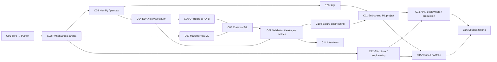

# Учебная программа Arvexo Arena: от AI literacy к проверяемой профессиональной основе

Дата среза: **20 июля 2026 года**. Статус документа: исследовательская спецификация curriculum, а не обещание трудоустройства и не описание уже реализованного продукта.

## 1. Решение

Arvexo не следует выпускать один линейный «курс по AI». Нужна общая компетентностная основа и пять разных выходов: **AI literacy, олимпиадный, Data Analyst foundation, ML internship и ML Engineer foundation**. Общий знаменатель — не число просмотренных уроков, а способность самостоятельно поставить вопрос к данным, получить воспроизводимый результат, честно его проверить, объяснить ограничения и перенести принцип на невиданный контекст.

**Главный вывод, уверенность средне-высокая:** 12 концептуальных уроков текущего AI Track полезны как seed для AI literacy и диагностики терминов, но не являются карьерной программой. Для internship-ready evidence нужны программирование, данные, статистика, валидация, инженерная воспроизводимость и защищённый end-to-end артефакт. Этот вывод поддерживают одновременно curriculum frameworks [CUR-F01–CUR-F06], 63 вакансии-сигнала [CUR-J01] и learning-science policy [CUR-L01]; ни один из этих источников по отдельности не доказывает employability выпускника Arena.

### 1.1 Что является фактом, оценкой и гипотезой

- **[Факт продукта]** Master TZ §10 описывает 12 вводных уроков для 7–11 классов без требования программирования; текущая ветка имеет один AI Track и 17 форматов заданий, но local seed использует только три базовых формата, а запуска Python/SQL/notebook нет [CUR-I01–CUR-I03].
- **[Факт аудита]** production-срез 18.07.2026 видел 14 уроков, только 3 доступных, повтор вопросов в Practice и отсутствие реальной code/CSV practice. Это snapshot одного аккаунта, не полный telemetry census [CUR-I02].
- **[Факт выборки после финального live-check]** в финальной матрице 63 уникальные карточки: **40 live, 3 pipeline и 20 archived/closed**; одна live pooled program исключена из строгого vacancy denominator, поэтому основной анализ — **39 live-primary вакансий**. Пять первоначально считавшихся live страниц Asia оказались expired, а US015 Vector — закрытой program page. Явные упоминания во всех 63: Python 38, deep learning 27, CV/NLP по 21, algorithms 21, deployment 19, metrics 18, validation 16, statistics 15, SQL/English по 14, portfolio/project evidence 12 и **строго названные conventional methods classical ML 7** [CUR-J01]. Generic ML и название роли не засчитывались как classical ML; `unknown` означает «не сказано», а не «не требуется».
- **[Ограничение]** выборка целевая, переоценивает AI research/big-tech, содержит несовместимые strata: undergraduate, MSc+, PhD и general early-career. Их нельзя усреднять в один «профиль стажёра». Частоты — только mention signals; нулевое явное упоминание `leakage`, `window functions` или `MLflow` не доказывает ненужность fundamentals/engineering.
- **[Оценка]** часы, календарная длительность, сложность и рекомендуемый порядок ниже — design estimates для пилота, а не нормативы научных рамок.
- **[Гипотеза]** verified artifact + individual defense лучше передаёт способность к работе, чем certificate/completion. Проверять нужно blinded review внешними специалистами и последующей невиданной задачей, а не кликами работодателя.

## 2. Основания curriculum и правила доказательности

### 2.1 Почему программа устроена так

1. ACM CCDS2021 задаёт широкий computing-core data science: programming/algorithms, data acquisition/governance, analysis/presentation, ML, privacy/security/integrity, professionalism и software development/testing; отдельно требует математику, статистику и прикладной домен [CUR-F01]. Поэтому notebook с одной моделью — недостаточный выпускной результат.
2. CC2020 связывает competency с **knowledge + skill + disposition**, а CS2023 сохраняет learning outcomes и professional dispositions, включая AI, data management, mathematical/statistical foundations, software development, engineering, security и ethics [CUR-F02–CUR-F03]. Поэтому каждое outcome ниже выражено наблюдаемым действием, а не «знает тему».
3. NASEM включает acquisition, management/curation, modeling, visualization, reproducible workflow, communication/teamwork, domain context и ethics; ethics должна проходить через программу, а не жить в последнем уроке [CUR-F04].
4. UNESCO и OECD/EC требуют для школьной AI literacy не только техники, но human agency, критическую оценку, ethical/creative use и системный дизайн [CUR-F05–CUR-F06]. Поэтому literacy-track не является урезанным «Python для детей».
5. Вакансии подтверждают существование связок `Python + data + evaluation`, `experiment → artifact`, `model → deployment` и role-specific specialization, но не задают универсальный порядок и глубину [CUR-J01].
6. Learning science требует разделить acquisition, retention, transfer и помощь. XP, streak, completion и best score не подтверждают mastery [CUR-L01–CUR-A01].
7. O*NET Data Scientists перечисляет подготовку/очистку, программирование, sampling/statistics, сравнение metrics, validation, visualization и stakeholder communication; O*NET Operations Research Analysts — постановку, model validation, experiment и communication [CUR-O01–CUR-O02]. ESCO даёт multilingual occupation/skill taxonomy, а не curriculum и не vacancy count [CUR-O03]. Эти role frameworks используются для triangulation; US/EU taxonomy нельзя напрямую объявлять российским hiring standard.

### 2.2 Единое правило mastery `GMR` для всех модулей

`GMR` — curriculum contract; численные starting rules нужно калибровать на Arena, они не являются «научными константами».

- Первый ответ фиксируется **до** feedback. `assistance_code=0` — самостоятельный; даже checker-only feedback (`H0`) делает текущую completion assisted.
- Практика с H0–H5 допустима и нужна для обучения, но не попадает в независимый mastery evidence. После помощи выдаётся новая recovery-задача без AI.
- Статус `Confirmed` требует одновременно: минимум две успешные `I3` попытки из разных item families с заранее заданным elapsed lag; минимум одну `I4` unseen/structural transfer; валидный `T14` no-hint probe; отсутствие unresolved critical error; versioned и нескомпрометированную форму. Для foundation skills `T30` добавляется после локальной валидации.
- Предлагаемый posterior `P(mastery) ≥ 0,90` применяется только при валидированной measurement model; малый пилот использует консервативную rubric conjunction без псевдоточной вероятности.
- Одна поздняя ошибка переводит evidence в `Contested` и запускает targeted probe, а не стирает всю историю. Best score также не блокирует обновление при устойчивых новых данных.
- В командном проекте каждый участник проходит individual `I3/I4` task и oral defense. Similarity detector только направляет на review.
- Критические семейства ошибок — leakage, использование test при выборе, выдуманные результаты/источники, privacy/security violation и нераскрытая существенная AI-помощь — требуют контрпримера и delayed probe.

### 2.3 Типы проверки и техническая честность

Маркировка в карточках:

- **`A0`** — реализуемо текущим детерминированным движком: `single_choice`, `multiple_choice`, `short_text`, `number`, `sequence`, `matching`, `group_sort`, `fill_blanks`, `table_select`, `code_order`, `code_output`, `code_fix`, `image_hotspot`, `graph_point`, `number_line`, `slider_experiment`, `code_text`. При этом нынешние `code_text/code_fix` сравнивают нормализованный текст и **не исполняют код**.
- **`A1`** — требует нового sandboxed Python/SQL runner, hidden tests, dataset/version store либо notebook execution. До этого нельзя заявлять проверку программирования.
- **`H`** — human/rubric review: открытая постановка, качество анализа, этика, коммуникация и defense. LLM может дать triage, но не быть единственным high-stakes scorer.

## 3. Карта зависимостей и объёма

Граф показывает основной professional path, не lockstep. C12 начинается спирально уже в C01; C15 собирает provenance с первого артефакта; ethics/privacy, communication, testing и reproducibility проходят через все модули. AI literacy использует отдельные `-L` slices без притворного карьерного выхода (§6).

| Модуль | Активная работа, часы | Относительная сложность 1–5 | Основной deliverable |
|---|---:|---:|---|
| C01 Zero → Python | 28–40 | 1 | консольная программа с тестами |
| C02 Python для анализа | 24–36 | 2 | модуль чтения/очистки данных |
| C03 NumPy/pandas | 30–44 | 2 | воспроизводимый data pipeline |
| C04 EDA/визуализация | 24–36 | 2 | аналитическая записка |
| C05 SQL | 30–45 | 2–3 | запросы + проверка результата |
| C06 Статистика/A-B | 36–54 | 3 | pre-analysis и experiment memo |
| C07 Математика ML | 36–54 | 3–4 | вычислительная лабораторная |
| C08 Classical ML | 36–54 | 3 | baseline/model comparison |
| C09 Validation/leakage/metrics | 30–45 | 4 | audit чужого pipeline |
| C10 Feature engineering | 24–36 | 3–4 | versioned feature pipeline |
| C11 End-to-end project | 45–70 | 4 | репозиторий + report + defense |
| C12 Git/Linux/engineering | 28–42 | 3 | tested CLI/package workflow |
| C13 API/deployment/production | 36–56 | 4 | service + ops plan |
| C14 Interviews | 24–40 | 3–4 | timed cases + explanation |
| C15 Portfolio | 20–35 | 3 | verified evidence bundle |
| C16 Specialization | 45–90 на одну ветку | 4–5 | domain capstone |

**[Оценка, низкая уверенность до пилота]** полный общий путь с одной специализацией — примерно **496–797 часов активной работы**, то есть 15–30 месяцев при 6–8 часах в неделю с учётом окон T14/T30 и пауз. Это не маркетинговое обещание completion. Диагностический bypass разрешён только через независимый I4-equivalent assessment, а не self-report.

## 4. Шестнадцать модулей

Ниже у каждой карточки присутствуют все 15 запрошенных полей. `Outcomes` — минимальный exit contract; теория не считается mastered без практики и переноса.

### C01 — С нуля до Python

1. **Prerequisites.** Базовая цифровая грамотность; арифметика и чтение простых графиков. Для 7–9 классов — readiness probe на переменные/условия; отсутствие опыта кода допустимо.
2. **Outcomes.** Самостоятельно декомпозировать небольшую задачу; написать, прочитать, запустить и отладить программу с вводом/выводом, типами, условиями, циклами, функциями и коллекциями; объяснить trace и граничные случаи.
3. **Theory.** Значение/тип/состояние; control flow; функции и scope; строки, списки, словари/множества; исключения; файлы; простая оценка сложности; мутабельность и чистые функции на интуитивном уровне.
4. **Practice.** Worked example → faded code completion → trace-before-run → самостоятельные задачи; минимум три семейства: transformation, aggregation, validation. Ошибки синтаксиса отделяются от ошибок логики.
5. **Task types.** `A0`: `code_order`, `code_output`, `code_fix`, `fill_blanks`, `sequence`, trace questions. `A1`: исполняемый `code_text` с hidden tests и лимитами.
6. **Mini-project.** CLI-анализатор журнала тренировок: чтение CSV-like файла, валидация строк, агрегаты, понятные сообщения об ошибках; без pandas.
7. **Summative check.** 60–90 минут: невиданный формат входа, 3 hidden cases, краткое объяснение инварианта и одна намеренно дефектная функция для debugging.
8. **Mastery criteria.** `GMR`: две I3 задачи разных семейств, I4 перенос с другой representation и T14 no-hint. Critical: hard-coded sample, непроверенный пустой ввод, выдуманный output. После любого hint — новый вариант code 0.
9. **Interview example.** «Сгруппируйте события по пользователю, сохранив порядок, и объясните complexity/edge cases» — оценивать reasoning, не golf.
10. **Employer task.** Прочитать небольшой event log, отфильтровать некорректные записи и вернуть summary с тестами.
11. **Tournament.** `Trace & Repair`: одинаковая спецификация, разные private cases; rating только по unaided code, correctness прежде скорости.
12. **Time.** **28–40 ч, оценка**; 5–8 недель при 5 ч/нед.
13. **Difficulty.** 1/5; главный риск — overload терминов и копирование готового кода.
14. **Order.** Первый professional module; C12/Git вводится с 2-й недели, C02 после Confirmed основных функций/коллекций.
15. **Auto-grading.** Сейчас достоверно только trace/order/text-pattern (`A0`). Для outcomes нужен `A1`: isolated Python, hidden property/unit tests, CPU/RAM/time limits, forbidden network/FS, test-version provenance; style/объяснение — `H`.

**Основание:** programming как foundation [CUR-F01, CUR-F03], Python как явный mention 38/63 и 26/39 live-primary [CUR-J01]. **Уверенность:** высокая в необходимости, низкая в часах.

### C02 — Python для анализа данных

1. **Prerequisites.** C01 Confirmed либо bypass assessment; понимание функций, коллекций, файлов и исключений.
2. **Outcomes.** Спроектировать повторно используемый анализ как функции/модули; прочитать CSV/JSON; валидировать schema; работать с датами, missing/duplicate values; написать pytest-like tests; не смешивать loading, transformation и presentation.
3. **Theory.** Iteration/comprehension/generator на практическом уровне; modules/packages; typing/dataclass; context managers; exceptions; serialization; logging; unit/property thinking; floating-point/encoding caveats.
4. **Practice.** Рефакторинг notebook-like script в функции; диагностировать silent coercion; tests-first для parsing; сравнить eager/streaming на малом примере.
5. **Task types.** `A0`: `code_order`, `code_output`, `matching`, `code_fix`. `A1`: executable parser/refactor, mutation tests. `H`: краткий design rationale.
6. **Mini-project.** Data quality profiler без pandas: schema report, missing/duplicate/outlier candidates, CLI и тестовый fixture.
7. **Summative check.** Исправить незнакомый pipeline с mixed encodings и неверной обработкой missing; добавить tests и changelog.
8. **Mastery criteria.** `GMR`; I4 меняет file format и schema. Critical: silent row loss, swallowing exceptions, data mutation без provenance; T14 — новый parser no-hint.
9. **Interview example.** «Почему функция возвращает разные результаты при повторном вызове и как локализовать side effect?»
10. **Employer task.** Превратить ad-hoc script аналитика в tested function/library с logging и clear failure mode.
11. **Tournament.** `Dirty Data Relay`: участники получают разные corruptions; баллы за корректность и диагностический report, не за число удалённых строк.
12. **Time.** **24–36 ч, оценка**.
13. **Difficulty.** 2/5; риск — преждевременный переход к pandas без модели данных.
14. **Order.** После C01; до C03; testing/Git синхронизируются с C12.
15. **Auto-grading.** `A1` hidden fixtures, deterministic environment, mutation/property tests; запрет exact-output-only для открытых решений. Архитектурное объяснение — rubric `H`.

**Основание:** ACM programming/software testing [CUR-F01, CUR-F03], 9/63 explicit testing и repeated data-work signals [CUR-J01]. **Уверенность:** средне-высокая; vacancy count testing — lower bound.

### C03 — NumPy и pandas

1. **Prerequisites.** C02; базовые таблицы/агрегации; математическая notation не обязательна сверх арифметики.
2. **Outcomes.** Выбрать vectorized representation; читать/соединять/reshape/aggregate таблицы; явно задавать dtypes и keys; строить воспроизводимый cleaning pipeline; проверять row counts, cardinality и invariants до/после join.
3. **Theory.** Arrays, shape, axis, broadcasting, dtype/copy/view; Series/DataFrame, index, selection, groupby, merge, reshape, missingness, categorical/datetime; memory/performance trade-offs без micro-optimization cult.
4. **Practice.** Prediction-before-execution для shapes; repair Setting/copy bugs; join audits; one-to-one/one-to-many validation; сравнение loop/vectorization по correctness и читаемости.
5. **Task types.** `A0`: `table_select`, `matching`, `code_output`, `group_sort`. `A1`: executable transformations, dataframe invariant tests. `H`: cleaning decision log.
6. **Mini-project.** Собрать clean analytical table из 3 versioned sources, сохранив data dictionary, join audit и quality report.
7. **Summative check.** Невиданный dataset с schema drift: восстановить grain, исправить merge explosion, подготовить typed table и доказать invariants.
8. **Mastery criteria.** `GMR`; I3 охватывают array/broadcast и relational table families; I4 — новая grain/shape; T14 no-hint. Critical: unnoticed duplicate multiplication, target-derived cleaning, lost identifiers/lineage.
9. **Interview example.** «После merge число строк выросло в 20 раз. Почему и какие проверки добавите?»
10. **Employer task.** Подготовить feature/analysis table из сырых таблиц с documented grain и data-quality assertions.
11. **Tournament.** `Join Integrity`: private tables и traps; primary score — correct rows + invariant proof, time — только tie-break.
12. **Time.** **30–44 ч, оценка**.
13. **Difficulty.** 2/5; conceptual difficulty shape/grain выше синтаксиса.
14. **Order.** После C02; открывает C04/C05; C09 позже проверяет, не протёк ли target в pipeline.
15. **Auto-grading.** `A1` сравнивает schema, rows with tolerances, invariants и lineage events; нельзя проверять только финальный CSV. Decision log — `H`.

**Основание:** data acquisition/management/governance [CUR-F01, CUR-F04]; NumPy/pandas названы лишь в 5/63, но Python/data work шире [CUR-J01]. **Уверенность:** высокая для skills, низкая для библиотечной конкретики в долгом горизонте.

### C04 — EDA и визуализация

1. **Prerequisites.** C03; базовые проценты и среднее/медиана.
2. **Outcomes.** Сформулировать data question до построения графика; описать grain, missingness и selection; выбрать chart по задаче; обнаружить anomaly/confounder candidate; отделить observation от causal claim; написать decision-oriented memo.
3. **Theory.** Distribution, center/spread, robust summaries, sampling/selection intuition; encodings/scales; small multiples; uncertainty; misleading axes/aggregation; accessibility; exploratory vs confirmatory analysis.
4. **Practice.** Critique/repair misleading charts; EDA на datasets с одинаковыми aggregate summaries; annotation; pre-question → plot → alternative explanation → next test.
5. **Task types.** `A0`: `table_select`, `image_hotspot`, `graph_point`, `multiple_choice`, `short_text`. `A1`: generated charts checked by spec/data. `H`: visual and claim rubric.
6. **Mini-project.** 2-page EDA memo по открытым данным: 3–5 figures, quality caveats, одна опровергнутая гипотеза и список следующих измерений.
7. **Summative check.** Получить незнакомый dataset и stakeholder question; за 90 минут выбрать 2 графика, найти ловушку aggregation и защитить вывод/невывод.
8. **Mastery criteria.** `GMR`; I4 меняет domain и chart representation; T14 critique no-hint. Critical: causal claim из correlation, скрытая фильтрация, misleading scale, PII disclosure.
9. **Interview example.** «Метрика выросла после релиза. Какие графики и разрезы построите до вывода об эффекте?»
10. **Employer task.** Подготовить exploratory memo для product/ops команды с reproducible figures и ограничениями данных.
11. **Tournament.** `Chart Forensics`: найти максимальное число **валидных** проблем и предложить repair; false accusation штрафуется.
12. **Time.** **24–36 ч, оценка**.
13. **Difficulty.** 2/5; основной риск — эстетика вместо reasoning.
14. **Order.** После C03; до C06 и C09; literacy slice возможен без полного Python.
15. **Auto-grading.** Data/chart spec и factual checks — `A1`; appropriateness, accessibility и wording — double-rubric `H`, AI только triage. Графическое совпадение пикселей невалидно.

**Основание:** analysis/presentation и communication [CUR-F01, CUR-F04], visualization 10/63 [CUR-J01]. **Уверенность:** высокая в outcome, средняя в format.

### C05 — SQL и реляционное мышление

1. **Prerequisites.** C03 outcomes о grain/key/join; Python не нужен внутри каждой задачи, но нужен для professional path.
2. **Outcomes.** Прочитать schema; написать корректные `SELECT`, filters, `GROUP BY`, joins, subquery/CTE и window calculations; отличить row grain до/после операции; проверить запрос независимым reconciliation; объяснить null semantics и performance на уровне плана.
3. **Theory.** Relations, keys/constraints, three-valued NULL logic; join types; aggregation order; CTE/subquery; window partition/order/frame; transactions на уровне аналитика; indexes/query plan intuition; SQL injection boundary.
4. **Practice.** Query prediction на маленьких таблицах; repair double-counting; translate business metric → grain → query → reconciliation; один результат несколькими способами; progressive fading.
5. **Task types.** `A0`: `table_select`, `code_order`, `code_output`, `matching`. `A1`: SQL runner с hidden database states и query/result properties. `H`: metric definition note.
6. **Mini-project.** Аналитическая витрина tournament funnel из normalized event tables: documented grain, 8–10 queries, QA reconciliation и dashboard-ready output.
7. **Summative check.** Невиданный schema; построить cohort/retention-like table, исправить double count и объяснить два edge cases NULL/window frame.
8. **Mastery criteria.** `GMR`; I3 покрывают join/aggregation и window/reconciliation; I4 меняет schema и business wording; T14 no-hint. Critical: multiplicative join без detection, denominator drift, destructive statement, exposed PII.
9. **Interview example.** «Для каждого пользователя найдите первую активность после регистрации и 7-дневный статус; объясните boundary dates».
10. **Employer task.** Проверить продуктовую метрику из warehouse и найти расхождение dashboard с source-of-truth.
11. **Tournament.** `SQL Case Arena`: private schemas/edge rows; балл за correctness across states и explanation, не за короткий запрос.
12. **Time.** **30–45 ч, оценка**.
13. **Difficulty.** 2–3/5; window functions вводятся после устойчивого grain/join.
14. **Order.** После C03; параллельно C04; обязателен для Analyst/ML internship, но не для базового literacy.
15. **Auto-grading.** Нужен `A1` read-only DB sandbox, statement whitelist, resource/time limits, hidden datasets, semantic result comparison и plan logging. Exact query string не оценивается; definition memo — `H`.

**Основание:** data management [CUR-F01, CUR-F03, CUR-F04], SQL явно 14/63 [CUR-J01], role taxonomy требует data work без фиксации одного dialect [CUR-O01–CUR-O03]. Ноль explicit `window_functions` — coding limitation объявлений, не основание удалить тему. **Уверенность:** высокая для Analyst, средняя для каждого ML role.

### C06 — Статистика, вероятность и A/B-эксперименты

1. **Prerequisites.** C04; школьная алгебра, функции и проценты. Недостающая probability readiness закрывается bridge unit.
2. **Outcomes.** Описать population/sample/estimand; моделировать случайность; оценить uncertainty; выбрать и проверить допущения базового интервала/теста; различить effect size, uncertainty и p-value; составить pre-analysis plan; распознать peeking, multiple testing и selection bias.
3. **Theory.** Probability/conditional probability; random variables/distributions; expectation/variance; sampling; LLN/CLT intuition; estimation/CI; hypothesis tests; power/MDE; randomization; A/B design, unit of assignment, interference, attrition, multiple comparisons; Bayesian interpretation только после базовой frequentist literacy и без лагерной риторики.
4. **Practice.** Simulations до формул; predict distribution; critique experiment memos; design-first calculations; analyze null/positive/heterogeneous examples; translate statistics into decision and caveat.
5. **Task types.** `A0`: `number`, `slider_experiment`, `graph_point`, `table_select`, `multiple_choice`, `short_text`. `A1`: simulation notebook and reproducible analysis. `H`: design/causal validity rubric.
6. **Mini-project.** Pre-analysis plan и simulation for Arena hint-policy experiment: estimand, assignment, primary outcome `T14` unaided transfer, guardrails, MDE sensitivity и attrition plan.
7. **Summative check.** Разобрать незнакомый A/B report с peeking, denominator change и practical/statistical significance conflict; пересчитать и дать decision memo.
8. **Mastery criteria.** `GMR`; I3 families probability/sampling и experiment design; I4 новый product domain/cluster unit; T14 no-hint. Critical: causal claim без identification, p-value как probability hypothesis, undisclosed multiple testing, fabricated exclusion.
9. **Interview example.** «Conversion выросла на 2%, p=0,03. Можно ли выкатывать? Какие данные нужны?»
10. **Employer task.** Спроектировать и проанализировать controlled experiment либо объяснить, почему рандомизация невозможна и какой weaker design допустим.
11. **Tournament.** `Experiment Court`: команды обвинение/защита, затем индивидуальный blind redesign; рейтинг только по individual case.
12. **Time.** **36–54 ч, оценка**.
13. **Difficulty.** 3/5; риск — ritual formula use и causal overclaim.
14. **Order.** После C04; параллельно C07; необходим до C08/C09 professional depth.
15. **Auto-grading.** Numerical/simulation invariants — `A0/A1`; open design не автооценивается одной моделью. `H` с versioned rubric, blind sample double-scoring и allowed-answer space.

**Основание:** math/statistics foundation [CUR-F01, CUR-F03, CUR-F04], statistics 15/63, A/B 4/63 [CUR-J01]. Низкая A/B частота отражает mix ролей. **Уверенность:** высокая в core, средняя в выбранной глубине.

### C07 — Математика для ML

1. **Prerequisites.** C01/C02, школьная алгебра и функции; readiness probe позволяет bridge по векторам/графикам.
2. **Outcomes.** Интерпретировать vectors/matrices, dot product, linear transformations, distance/norm; связать derivative/gradient с optimization; объяснить objective/regularization; вычислить малый шаг gradient descent и диагностировать scale/conditioning на интуитивно-прикладном уровне.
3. **Theory.** Linear algebra: vectors, matrices, systems, rank intuition, projections/eigen intuition. Calculus: slope, partial derivative, gradient, chain rule intuition. Optimization: loss, convexity intuition, learning rate, regularization. Probability links to likelihood.
4. **Practice.** Visual/number/code representations одного понятия; ручные малые вычисления → NumPy implementation → interpretation; derive only what informs model behavior; worked examples с fading.
5. **Task types.** `A0`: `number`, `matrix-like table_select`, `graph_point`, `matching`, `sequence`, `code_output`. `A1`: numeric notebook with tolerance/property tests. `H`: geometric/causal explanation.
6. **Mini-project.** Реализовать linear regression/gradient descent на NumPy, сравнить с closed-form/library baseline и исследовать scaling/regularization.
7. **Summative check.** Невиданный loss surface/data scaling scenario: вычислить шаг, предсказать failure, выбрать remedy и объяснить связь с model behavior.
8. **Mastery criteria.** `GMR`; I3 охватывают representation translation и optimization; I4 перенос на новую loss/geometry; T14 no-hint. Critical: dimensionally invalid operation, formula without meaning, claim convergence without evidence.
9. **Interview example.** «Почему feature scaling влияет на gradient descent, но не меняет саму линейную выразимость модели?»
10. **Employer task.** Прочитать model/optimization note, воспроизвести ключевое вычисление и объяснить trade-off команде.
11. **Tournament.** `Loss Landscape`: prediction rounds до исполнения, затем code verification; speed не компенсирует неверное reasoning.
12. **Time.** **36–54 ч, оценка**; возможен 15–25-часовой bridge до него.
13. **Difficulty.** 3–4/5; риск — proof-heavy gatekeeping либо, наоборот, API use без модели.
14. **Order.** После C02, параллельно C06; до deep understanding C08; literacy берёт только conceptual slice.
15. **Auto-grading.** `A0/A1` numeric tolerance, symbolic equivalence только при надёжной parser policy, randomized dimensions; explanation — `H`. Нельзя принимать exact float/string.

**Основание:** ACM прямо добавляет calculus, probability/statistics, linear algebra к computing DS KAs [CUR-F01]; CS2023 усиливает MSF [CUR-F03]. В raw jobs linear algebra отмечена только 2/63, что не измеряет скрытые prerequisites. **Уверенность:** высокая в foundation, средняя в calculus depth.

### C08 — Классическое машинное обучение

1. **Prerequisites.** C03, C06 foundation и C07 core; C04 для data understanding.
2. **Outcomes.** Перевести decision question в supervised/unsupervised formulation; построить dummy/heuristic baseline; обучить и сравнить linear/logistic models, trees/ensembles, kNN и clustering where appropriate; объяснить inductive bias, hyperparameters и limitations; не путать fit с evaluation.
3. **Theory.** ML workflow; regression/classification/clustering; linear/logistic models; trees, bagging/boosting intuition; neighbors; regularization; imbalance; calibration introduction; pipelines; bias/variance; interpretability boundary.
4. **Practice.** Model cards через contrast cases; baseline-first; prediction before metric; same dataset/multiple models; error slices; library API только рядом с conceptual probes.
5. **Task types.** `A0`: `matching`, `group_sort`, `code_order`, `code_output`, `table_select`, `slider_experiment`. `A1`: train/predict pipeline on versioned data. `H`: method selection and limitation memo.
6. **Mini-project.** Baseline-to-model comparison on tabular public data: documented split, pipeline, at least three justified models, slice analysis, compute/interpretability trade-off.
7. **Summative check.** Невиданный stakeholder problem/data card: выбрать formulation/baseline/model family, реализовать minimum pipeline и отклонить неподходящую модель с объяснением.
8. **Mastery criteria.** `GMR`; две I3 model families, I4 новая decision consequence/data representation, T14 no-hint. Critical: no baseline, evaluation on train, target leakage, metric chosen after seeing test, unsupported causal claim.
9. **Interview example.** «Почему boosted trees могут выиграть на tabular data и когда вы всё равно выберете logistic regression?»
10. **Employer task.** Построить reproducible baseline и model comparison, пригодные для review, а не максимизировать leaderboard score.
11. **Tournament.** `Baseline Duel`: ограниченный compute и public/private split; scoring включает robustness и reproducibility, hidden test — только часть результата.
12. **Time.** **36–54 ч, оценка**.
13. **Difficulty.** 3/5; риск — zoo of algorithms без выбора и честной оценки.
14. **Order.** После C06/C07 core; C09 должен идти немедленно следом и частично встраиваться уже здесь.
15. **Auto-grading.** `A1` deterministic seeds/environment, data/version hash, hidden tests for pipeline behavior; score alone недостаточен. Method memo/model card — `H`.

**Основание:** ACM ML competencies требуют principled selection, training/testing, metrics, overfitting и responsibility [CUR-F01]; strict classical-method mentions составляют лишь 7/63 и 5/39 live-primary после исключения generic ML [CUR-J01]. **Уверенность:** высокая в необходимости foundation из framework/workflow, низкая в оценке demand по literal vacancy wording.

### C09 — Валидация, leakage и метрики

1. **Prerequisites.** C04, C06 и C08; grain/time awareness из C03/C05.
2. **Outcomes.** Спроектировать split по production mechanism; разделить train/validation/test; выбрать metric по cost/decision; применить cross-validation без contamination; распознать target/time/group leakage, proxy discrimination и metric gaming; оценить uncertainty, slices, calibration и threshold trade-offs.
3. **Theory.** Generalization; holdout/CV/nested CV; grouped/time splits; preprocessing inside folds; hyperparameter selection; metrics classification/regression/ranking intro; imbalance; calibration; thresholding; confidence intervals/variance; leakage taxonomy; benchmark contamination.
4. **Practice.** Forensic review сломанных notebooks; сначала нарисовать data-generating timeline; metric consequence cases; leak injection/repair; delayed error replay.
5. **Task types.** `A0`: `sequence`, `group_sort`, `table_select`, `matching`, `multiple_choice`, `short_text`. `A1`: pipeline audit with hidden leakage tests. `H`: split/metric justification.
6. **Mini-project.** `Honest Evaluation Audit`: получить inflated model, найти минимум три failure modes, пересобрать validation, quantify score drop и объяснить, почему он полезен.
7. **Summative check.** Невиданный time/grouped dataset с tempting leak; создать evaluation protocol, metric/threshold memo и run reproducible baseline.
8. **Mastery criteria.** `GMR`; I3 из split и metric families, I4 новый domain/temporal mechanism, T14 no-hint. Любая leakage/test-selection ошибка — unresolved critical до counterexample + delayed probe; high score не компенсирует.
9. **Interview example.** «Offline AUC 0,95, production хуже random. Назовите порядок расследования и возможные leakage paths».
10. **Employer task.** Провести pre-launch model validation и написать go/no-go memo с subgroup/operational risks.
11. **Tournament.** `Leakage Hunt`: баллы за validated findings; false positives и просмотр hidden labels штрафуются; одна часть — individual I4.
12. **Time.** **30–45 ч, оценка**.
13. **Difficulty.** 4/5; это gate, а не elective polish.
14. **Order.** После C08, до C10/C11; элементы вводятся в C03–C08 спирально.
15. **Auto-grading.** `A1` static/dynamic checks, lineage graph, fold-aware transformations, hidden temporal/group tests. Открытое threat model и decision memo — `H`; LLM не единственный judge.

**Основание:** training/testing, overfitting, performance metrics и integrity в CCDS2021 [CUR-F01]; metrics 18/63, validation 16/63, но literal leakage 0/63 [CUR-J01]. **Уверенность:** высокая из framework/mission, не из literal vacancy frequency.

### C10 — Feature engineering

1. **Prerequisites.** C03, C08 и C09; C05 для relational sources.
2. **Outcomes.** Создать features, доступные в prediction time; построить fold-safe transformations; обработать categorical/text/time signals на foundation level; оценить stability, missingness и importance caveats; version features and lineage; отказаться от feature, нарушающего privacy/fairness.
3. **Theory.** Representation and inductive bias; scaling/encoding/imputation; interaction/aggregation; time windows; text basics; pipeline fit/transform semantics; selection/regularization; feature stores concept; proxy/privacy/fairness; drift.
4. **Practice.** Availability-time diagrams; transform inside CV; ablation studies; feature review checklist; generate candidates then reject unsafe/unreliable ones; unseen schema recovery.
5. **Task types.** `A0`: `group_sort`, `matching`, `code_order`, `table_select`, `short_text`. `A1`: executable sklearn-like pipeline, temporal availability tests. `H`: feature card/risk rationale.
6. **Mini-project.** Versioned feature pipeline with raw-to-feature lineage, data contracts, 3 ablations and leakage/privacy review.
7. **Summative check.** Невиданный temporal task: исправить leaky aggregates, реализовать two safe features, compare against baseline и объяснить deploy-time availability.
8. **Mastery criteria.** `GMR`; I3 numerical/categorical and temporal families, I4 new schema/domain, T14 no-hint. Critical: future information, target encoding outside folds, sensitive proxy without review, irreproducible manual feature.
9. **Interview example.** «Какие признаки для churn доступны в момент предсказания и как избежать leakage в rolling aggregates?»
10. **Employer task.** Добавить production-feasible features в pipeline с offline/online parity checks и ablation evidence.
11. **Tournament.** `Feature Budget`: ограничение на число/стоимость/latency features; private temporal split; reward robust gain, not public overfit.
12. **Time.** **24–36 ч, оценка**.
13. **Difficulty.** 3–4/5; риск — competition tricks без production semantics.
14. **Order.** После C09; до C11; specialization-specific feature work продолжается в C16.
15. **Auto-grading.** `A1` pipeline execution, temporal/lineage assertions, ablation reproducibility and compute budget; ethical appropriateness — `H`.

**Основание:** ACM data process from raw data to features and model [CUR-F01]; literal feature engineering 2/63 is a wording lower bound [CUR-J01]. **Уверенность:** высокая для concept, средняя для tooling.

### C11 — End-to-end ML project

1. **Prerequisites.** C03–C10 core; C05 обязателен, если данные relational; базовый C12/Git уже используется.
2. **Outcomes.** Уточнить stakeholder decision и non-goal; составить data/ethics card; получить и проверить данные; построить baseline, validation и model; провести error/slice analysis; сделать reproducible run; дать recommendation с uncertainty; защитить вклад и перенести решение на change request.
3. **Theory.** Lifecycle `problem → data → baseline → model → evaluation → decision → monitoring`; requirements/constraints; project risk; experiment log; reproducibility; model/data cards; stakeholder communication; teamwork/contribution provenance.
4. **Practice.** Milestone reviews с kill criteria; short vertical slice до расширения; failure log; peer review по rubric; deliberate change requests; individual explanations вместо «демо команды».
5. **Task types.** `A0`: design sequences, data/metric choices. `A1`: repository/notebook execution, hidden data contract tests. `H`: question quality, interpretation, ethics, report и defense.
6. **Mini-project.** Сам модуль — scoped project на открытом/licensed dataset; сначала 1-week baseline slice, затем полный reproducible evidence bundle.
7. **Summative check.** Blind technical review + 12–20-минутная defense + невиданный change request: новая subgroup, shifted prevalence, missing column или latency constraint; выполнить индивидуально без AI.
8. **Mastery criteria.** `GMR` применяется к 4 anchor competencies: problem framing, data integrity, honest evaluation, communication. Необходимы reproducible fresh run и individual I4 change. Critical: fabricated metric/source, leakage, privacy/license breach, чужой вклад без disclosure.
9. **Interview example.** «Расскажите о решении, которое ухудшило offline score, но сделало вывод честнее. Как вы это доказали?»
10. **Employer task.** Получить ambiguous brief, задать clarifying questions, доставить baseline/report/repo и провести review, а не только notebook screenshot.
11. **Tournament.** `Case Sprint`: одинаковый decision brief, разные seeded datasets; public score ограничен, финал — reproducibility + defense + private shift.
12. **Time.** **45–70 ч, оценка**; минимум 6–10 календарных недель из-за review/rework.
13. **Difficulty.** 4/5; scope и evidence важнее algorithm novelty.
14. **Order.** После C10; до полного C13/C15; может идти параллельно продвинутому C12.
15. **Auto-grading.** `A1` запускает frozen environment, data contracts, tests, notebook top-to-bottom и metric recomputation. `H` минимум двумя reviewers для certification sample; AI не решает authorship/quality самостоятельно.

**Основание:** recursive data cycle, domain and communication in CCDS/NASEM [CUR-F01, CUR-F04], O*NET end-to-end tasks [CUR-O01–CUR-O02], portfolio/project evidence 12/63 и 7/39 live-primary [CUR-J01]. **Уверенность:** высокая в структуре; causal value portfolio для найма пока гипотеза.

### C12 — Git, Linux и инженерная воспроизводимость

1. **Prerequisites.** C01 basics; module начинается спирально и завершается после C11-level code.
2. **Outcomes.** Работать с Git branch/commit/merge/review; пользоваться shell, paths, permissions, processes и environment variables безопасно; структурировать package/CLI; фиксировать dependencies/config; писать unit/integration tests и CI; диагностировать reproducibility failure.
3. **Theory.** Version-control graph; meaningful commits/review; filesystem/process/stdin/stdout/exit codes; environment/secrets; packaging; logging/config; test pyramid/property/integration; CI; security basics; licensing/dependency provenance.
4. **Practice.** Repair merge conflict; reproduce чужой run from clean checkout; write failing test first; debug path/encoding/env issue; rotate exposed mock secret; code review with evidence.
5. **Task types.** `A0`: command ordering, failure diagnosis, diff review. `A1`: ephemeral repo/Linux container, test/CI task. `H`: review quality and threat rationale.
6. **Mini-project.** Превратить C02/C03 pipeline в package + CLI: Git history, tests, lockfile, CI, README quickstart и reproducibility badge backed by run log.
7. **Summative check.** Fresh container: checkout unfamiliar repo, fix failing test/config, add feature branch, pass CI и объяснить changes/security implications.
8. **Mastery criteria.** `GMR`; I3 covers version-control and Linux/test families, I4 new repo/tool constraint, T14 clean-reproduction no-hint. Critical: committed secret/PII, destructive broad command, bypassed tests, unreproducible hidden local state.
9. **Interview example.** «Тест проходит локально, падает в CI. Как будете уменьшать пространство причин?»
10. **Employer task.** Подготовить reviewable pull request с tests, migration/config note и rollback thinking.
11. **Tournament.** `Broken Build`: isolated repo, staged failures; балл за correct minimal fix, tests и incident explanation.
12. **Time.** **28–42 ч, оценка**, распределённые по C01–C13.
13. **Difficulty.** 3/5; риск — список команд без mental model и unsafe shell copying.
14. **Order.** Ввод с C01; independent capstone после C11; required before C13/C15.
15. **Auto-grading.** `A1` disposable container/repo, command audit, tests, secret scanner as review trigger, resource/network denial. Review explanation — `H`; scanners не adjudicate misconduct.

**Основание:** ACM software development/testing and CS2023 SE/SDF/security [CUR-F01, CUR-F03]; Git 8/63, testing 9/63, Linux 3/63 — explicit lower bounds, O*NET software list includes Git/Linux [CUR-J01, CUR-O01]. **Уверенность:** высокая, несмотря на низкую vacancy wording frequency.

### C13 — API, deployment и production ML

1. **Prerequisites.** C09, C11 и C12 Confirmed; networking/HTTP bridge.
2. **Outcomes.** Упаковать inference/analysis в typed API; валидировать inputs; отделить model artifact/config/code; containerize; провести unit/integration/load smoke tests; определить latency/cost/SLO, logging/monitoring, drift/quality/rollback; составить threat/privacy model.
3. **Theory.** HTTP/API contracts; serialization/schema/versioning; batch vs online; model registry concept; Docker/container isolation; CI/CD; observability; data/concept drift and label delay; canary/rollback; authentication/rate limits; supply-chain/secrets; cloud as option, не prerequisite.
4. **Practice.** Build local API → adversarial inputs → container → staging; incident cases; model version mismatch; shadow/canary simulation; monitor that maps to decision, not dashboard decoration.
5. **Task types.** `A0`: architecture matching, incident sequencing, metric selection. `A1`: API/container hidden contract, load and security tests. `H`: SLO/threat/rollback review.
6. **Mini-project.** Serve C11 model via FastAPI-compatible contract, Dockerfile, `/health`/version metadata, tests, structured logs, monitor/rollback runbook; no public cloud required.
7. **Summative check.** Невиданный breaking-schema/latency incident: reproduce, patch compatibly, demonstrate rollback and write 1-page postmortem.
8. **Mastery criteria.** `GMR`; I3 API correctness and operations families, I4 unfamiliar version/failure mode, T14 fresh deployment no-hint. Critical: unauthenticated sensitive endpoint, secret in image, train-serving mismatch, silent failure, no rollback for high-impact change.
9. **Interview example.** «Model quality стабильна offline, но complaints растут. Какие service/data/model signals проверите и в каком порядке?»
10. **Employer task.** Доставить reviewable inference service в staging с contract tests, observability и safe rollout plan.
11. **Tournament.** `Production Incident`: identical service, randomized faults; primary score correctness/safety/recovery, latency only under valid output.
12. **Time.** **36–56 ч, оценка**.
13. **Difficulty.** 4/5; cloud/Kubernetes не gate foundation.
14. **Order.** После C11/C12; для ML internship допустим lite-slice, для MLE foundation обязателен полностью.
15. **Auto-grading.** `A1` isolated container, network denied by default, contract/property/load tests, vulnerability scan, resource caps and reproducible build hash. Threat model/postmortem — `H`.

**Основание:** deployable systems/testing in CCDS2021 [CUR-F01], CS2023 SE/security [CUR-F03], deployment 19/63 и O*NET software ecosystem [CUR-J01, CUR-O01]. **Уверенность:** высокая для lifecycle, средняя для конкретного FastAPI/Docker stack.

### C14 — Интервью и рабочие case-задачи

1. **Prerequisites.** Target-track core: Analyst — C01–C06/C09/C11; ML — C01–C12; MLE adds C13. Readiness строится по skill gaps, не calendar unlock.
2. **Outcomes.** Уточнить ambiguous requirement; решить timed Python/SQL/statistics/ML case; verbalize assumptions/edge cases; отладить незнакомый artifact; рассказать о проекте с evidence; честно обозначить unknown и предложить verification.
3. **Theory.** Interview formats and rubrics; requirement clarification; structured reasoning; algorithm/data complexity foundation; behavioral evidence using situation/action/evidence/limitation; bias/accommodation awareness; company-specific research boundaries.
4. **Practice.** Retrieval/interleaving across domains; mock interviews with calibration; think-aloud then silent variant; interviewer role/peer review; error replay; no memorized answer scripts.
5. **Task types.** `A0`: code/SQL output, concept discrimination. `A1`: timed executable case. `H`: communication, clarification and project defense.
6. **Mini-project.** Personal interview evidence pack: 8 representative cases, error taxonomy, 3 project stories tied to verifiable commits/results, target-role gap plan.
7. **Summative check.** Two blinded sessions: technical case plus project/incident defense; second uses novel data/domain. Interviewer records rubric and uncertainty, not personality score.
8. **Mastery criteria.** `GMR` per target competency; I4 is unseen timed case without AI, T14 mixed retrieval. Critical: fabricated experience/result, hidden external answer, unsafe code/query, confident unsupported claim.
9. **Interview example.** «Спроектируйте offline evaluation для ranking system и объясните, какие online outcomes она не гарантирует».
10. **Employer task.** Same as summative: clarify, solve, test, communicate trade-offs and document next step under timebox.
11. **Tournament.** `Case Interview League`: calibrated cases, rotating reviewers, appeals; leaderboard never exposed as employer suitability score.
12. **Time.** **24–40 ч, оценка**, лучше 6–8 недель interleaved with applications/projects.
13. **Difficulty.** 3–4/5; anxiety/speed and language are construct-irrelevant risks requiring accommodations.
14. **Order.** После role core and first defended project; не заменяет curriculum и не начинается с grinding.
15. **Auto-grading.** Deterministic portions `A0/A1`; communication/open design `H`, structured rubric, rater training and appeal. Voice/accent/emotion inference запрещены.

**Основание:** вакансии дают task/skill signals, но почти не раскрывают реальный interview process [CUR-J01]; communication/problem solving validated in ACM/NASEM/O*NET [CUR-F01, CUR-F04, CUR-O01–CUR-O02]. **Уверенность:** средняя; format employer-specific.

### C15 — Verified portfolio

1. **Prerequisites.** Минимум C11 и C12; один дополнительный role-specific artifact; consent/publication settings.
2. **Outcomes.** Выбрать репрезентативные артефакты; опубликовать воспроизводимый evidence bundle; раскрыть data/license/AI/collaboration provenance; объяснить личный вклад, limitations и failures; выполнить unseen change и defense; поддерживать version/revocation.
3. **Theory.** Evidence vs showcase; selection bias; provenance; authorship uncertainty; licensing/privacy; audience-specific narrative; accessibility; rubric/versioning; truthful outcome claims.
4. **Practice.** Artifact audit; reproduce peer repo from clean environment; reviewer challenge; redact PII; rewrite claims from boast to evidence; compare assisted build and independent verification.
5. **Task types.** `A0/A1`: metadata completeness, links/hash/build/test checks. `H`: problem framing, reasoning, communication, originality uncertainty and defense.
6. **Mini-project.** Собрать первый verified bundle из C11 + C12/C13 artifact по schema §8, не новый декоративный сайт.
7. **Summative check.** Blind reproduction by reviewer, 12–20-min oral defense and individual I4 change request; public page unlocks only after privacy/license review.
8. **Mastery criteria.** `GMR` относится к underlying skills, не к красоте страницы. Portfolio badge требует successful reproducibility, I4 defense и T14 probe по anchor skills. Critical: fabricated metric/reviewer, hidden material AI/peer contribution, license/PII breach.
9. **Interview example.** «Покажите commit, где вы исправили leakage, и воспроизведите, как изменился вывод».
10. **Employer task.** Передать concise repo/report/evidence, который reviewer может воспроизвести, затем выполнить small change request.
11. **Tournament.** `Artifact Defense`: anonymized blind review и live change; social likes/traffic не входят в score.
12. **Time.** **20–35 ч, оценка**, сверх времени создания underlying projects.
13. **Difficulty.** 3/5; трудность — provenance and defense, не web design.
14. **Order.** Начинается как logging с C01, формально после C11/C12; C13/C16 добавляют specialized artifacts.
15. **Auto-grading.** Metadata/hash/build/test checks `A1`; human defense required. Plagiarism/similarity/LLM detectors only queue review and never automatically reject.

**Основание:** ACM professionalism/communication and NASEM reproducibility [CUR-F01, CUR-F04], portfolio/project evidence 12/63 и 7/39 live-primary [CUR-J01]. **Уверенность:** высокая в integrity requirements, низкая в claim о hiring uplift до employer study.

### C16 — Специализации

1. **Prerequisites.** C01–C12 and C15 core; C13 для ML systems; branch readiness probe. Research/DL branch может требовать углублённый C07.
2. **Outcomes.** Выбрать **одну**, а не «пройти всё»: `S-NLP/LLM`, `S-CV`, `S-Ranking/Recsys`, `S-TimeSeries/Experimentation`, `S-ML Systems` или `S-Research/Olympiad`; применить domain data/metrics/baseline; прочитать primary technical material; реализовать и защитить branch capstone; указать limits/safety.
3. **Theory.** Общий spine: domain representation, architectures/method families, task-specific metrics, benchmark validity, compute/data constraints, failure/safety. Branch depth: NLP tokenization/embeddings/transformers/evaluation; CV image pipelines/augmentation; ranking retrieval/ranking/offline-online gap; time-series temporal validation; systems serving/monitoring; research experimental method.
4. **Practice.** Paper/docs reproduction на малом масштабе; baseline before advanced method; adversarial/slice tests; ablation; compute budget; compare classic and neural/AI-native solution where appropriate.
5. **Task types.** `A0`: concept/metric/split discrimination. `A1`: domain runner and benchmark with private shift. `H`: paper critique, risk, capstone and defense.
6. **Mini-project.** 2–3-недельная branch reproduction with ablation and failure report; она становится vertical slice capstone.
7. **Summative check.** Capstone + external-style review + unseen distribution/requirement shift; research branch дополнительно защищает experimental design, systems branch — incident/rollback.
8. **Mastery criteria.** `GMR` on 3 branch anchors; I4 changes dataset/domain condition, T14 no-hint; no unresolved branch critical error (benchmark contamination, train/test identity leak, unsafe model/data handling, fabricated comparison).
9. **Interview example.** NLP: «Как оценить RAG без смешения retrieval и generation?» CV: «Почему random split завышает качество?» Ranking: «Почему offline NDCG не гарантирует online outcome?» Systems: «Как безопасно обновить model?»
10. **Employer task.** Reproduce branch baseline, improve one justified dimension, document trade-off and ship a reviewable change under compute/data limits.
11. **Tournament.** Branch league с private distribution shift и compute cap; общий рейтинг между несопоставимыми branches запрещён.
12. **Time.** **45–90 ч на одну branch, оценка**; research-heavy branch может быть дольше.
13. **Difficulty.** 4–5/5; deep learning не используется как beginner attraction gate.
14. **Order.** После common foundation; специализация следует target role/project, а не hype. Вторая branch — только после первого capstone и реального JTBD.
15. **Auto-grading.** `A1` branch-specific isolated runner, data/benchmark/version hash, private shifts, compute cap; open scientific/ethical claims и defense — expert `H`.

**Основание:** vacancy sample часто называет DL 27/63, CV/NLP по 21/63, но это преимущественно AI-heavy sample и mixed education levels [CUR-J01]; frameworks требуют foundation and role/domain context [CUR-F01, CUR-F03, CUR-F04]. **Уверенность:** высокая для branch-after-core, средняя для branch menu, низкая для market size каждой branch.

## 5. Общие сквозные competencies

Чтобы ethics/communication/testing не превратились в «модули в конце», каждый C-модуль обязан добавить evidence минимум по следующим тегам:

| Тег | Наблюдаемое действие | Где проверяется повторно |
|---|---|---|
| `RESP.DATA` | указывает источник/license, grain, allowed use, privacy и quality risks | C03, C04, C09, C11, C15 |
| `RESP.AI` | различает human/AI responsibility, раскрывает помощь, проверяет output и harm | literacy, C08–C16 |
| `REPRO` | другой человек/runner воспроизводит результат по versioned inputs | C02–C03, C08–C13, C15–C16 |
| `TEST` | формулирует failure mode и проверку до заявления успеха | C01–C03, C05, C08–C13 |
| `COMM` | объясняет decision, evidence, uncertainty и limitation для заданной аудитории | C04, C06, C11, C14–C16 |
| `COLLAB` | фиксирует вклад, проводит review и принимает challenge | C11–C16 |
| `LEARN` | находит authoritative source, воспроизводит и калибрует уверенность | C07–C16 |

Наличие тега в activity не равно mastery: только independent versioned evidence по `GMR` может подтвердить competency.

## 6. Пять разных треков

Суффиксы ниже означают **другие exit outcomes**, а не «облегчённый сертификат» полного модуля:

- `-L` — literacy slice: понять, критически оценить и создать простую модель/сценарий без professional coding claim;
- `-A` — analyst context: decision/SQL/statistics, без полного production ML;
- `-O` — olympiad context: problem solving/experimentation под timebox, без career/production claim;
- `-lite` — явно перечисленный subset, который не засчитывается за полный module `Confirmed`.

### T1 — AI literacy

- **Entry.** 7–11 класс или взрослый новичок; программирование и высшая математика не требуются. Readiness: digital safety, чтение таблиц и ability to explain choice. Несовершеннолетним — age/privacy safeguards [CUR-F05–CUR-F06].
- **Path.** `AL0 repaired seed (Master TZ §10) → C04-L → C06-L → C08-L → C09-L → C11-L`. `AL0` покрывает AI/ML distinctions, data/features/target, splits/metrics/leakage и responsible AI; slices добавляют observable analysis, uncertainty, critique and system-design challenge.
- **Exit.** Ученик объясняет, где AI уместен; проверяет output/source; различает prediction и causal claim; находит data/metric/leakage/bias/privacy risk; создаёт и защищает no-code или scaffolded AI-system proposal на уровне UNESCO `Understand → Apply`, с первым controlled `Create` artifact. Это **не** Python/ML engineer readiness.
- **Evidence.** Две individual concept/critique families + unseen cross-domain case + T14 no-hint; artifact содержит human-agency/ethics/system-design rubric. Current multiple-choice completion недостаточна [CUR-L01, CUR-F05–CUR-F06].
- **Duration.** **30–55 ч, оценка/гипотеза**, 8–14 недель; исходные 12×10–20 минут — только content exposure, не вся практика/retention.
- **Exclusions.** Полный Python, SQL, calculus, model tuning, deployment, interview preparation и employer-facing badge. No career or olympiad medal promise.
- **Distinct JTBD.** Безопасно и осмысленно пользоваться/оценивать AI, а не получить первую ML-работу.

### T2 — Олимпиадный трек

- **Entry.** Устойчивый школьный algebra/problem-solving baseline; Python diagnostic. Новичок проходит AL0/C01, опытный может bypass только independent assessment.
- **Path.** `AL0 → C01 → C02 → C03 → C04 → C06 → C07 → C08 → C09 → C10-O → C11-O → C16-S-Research/Olympiad`; C05 optional по формату конкретной олимпиады.
- **Exit.** Самостоятельно читает условие, строит baseline/experiment, честно разделяет data, выбирает metric, диагностирует failure, работает под time/compute constraint и объясняет решение. Theory-only tournament остаётся отдельным начальным division.
- **Evidence.** Rated event измеряет только announced competition outcome; mastery — отдельные I3/I4/T14 probes. Public/private split, versioned bank, option/task exposure audit; final включает unseen transfer and explanation.
- **Duration.** **280–430 ч, оценка с низкой уверенностью**; зависит от starting math/code и конкретной олимпиады.
- **Exclusions.** SQL/product analytics, full deployment, hiring portfolio/interview не обязательны; победа не означает internship readiness. Не обещать НТО outcome: формат/селекция внешней олимпиады меняются.
- **Distinct JTBD.** Подготовка к честному problem-solving competition, а не production role.

### T3 — ML internship

- **Entry.** Старшие школьники/студенты с algebra readiness и 6–8 ч/нед; либо Confirmed C01–C04. Трек адресует undergrad/general internship stratum, не PhD research postings.
- **Path.** `C01 → C02 → C03 → C04 → C05 → C06 → C07-core → C08 → C09 → C10 → C11 → C12 → C13-lite → C14-ML → C15`; затем **одна** C16 branch только если target vacancy её требует.
- **Exit.** Выполнен minimum internship set §7: Python/data/SQL/statistics, honest ML evaluation, Git/testing/reproducibility, defended end-to-end project и timed unseen case. Learner умеет подключиться к code review and supervised project; это не claim автономной production ownership.
- **Evidence.** Минимум три bundles: data-quality pipeline, validation/leakage audit, graduation project; по anchor skills `GMR`, reproducible run, oral defense, I4 change request. Target vacancy gap sheet обновляется по live official page.
- **Duration.** **380–600 ч, оценка**, 12–24 месяца part-time; bypass может сократить instruction, но не delayed/transfer evidence.
- **Exclusions.** PhD research/publishing, distributed training, CUDA, advanced DL/RL, Kubernetes-scale MLOps, гарантированная стажировка. Commercial experience не симулируется значком.
- **Distinct JTBD.** Доказать readiness к supervised entry-level ML work через reproducible evidence.

### T4 — Data Analyst foundation

- **Entry.** Школьная алгебра/проценты, базовая цифровая грамотность; Python может начинаться с нуля.
- **Path.** `C01 → C02 → C03 → C04 → C05 → C06 → C09-A → C11-A → C12-core → C14-A → C15`; C08 baseline optional для predictive analytics, C13-BI/API lite optional.
- **Exit.** Из ambiguous question делает metric/data definition, пишет проверяемый SQL/Python, строит EDA/experiment memo, выполняет reconciliation, сообщает uncertainty и recommendation, воспроизводит analysis. Не заявляет ML Engineer skills.
- **Evidence.** I4 case меняет schema/domain/denominator; T14 mixed SQL/statistics probe; analyst capstone включает metric dictionary, queries, reproducible memo and stakeholder defense.
- **Duration.** **250–400 ч, оценка**, 9–16 месяцев part-time.
- **Exclusions.** Full C07 math, algorithm zoo, deep learning, online model serving и ML systems. BI vendor может быть elective, но не curriculum core.
- **Distinct JTBD.** Надёжное data-informed решение и communication, а не model deployment.

### T5 — ML Engineer foundation

- **Entry.** C01–C09 Confirmed либо строгий bypass; для direct entry — tested Python, Git/Linux, basic ML evaluation. Не позиционировать как zero-to-job short bootcamp.
- **Path.** `C01–C13 full → C14-MLE → C15 → C16-S-ML Systems + одна domain branch optional`. C12 interleaved с самого начала; C09 остаётся gate для C13.
- **Exit.** Строит tested package/service, воспроизводит model build, держит train/serve contract, проектирует monitoring/rollback/security, расследует incident и объясняет model/operational trade-off. Foundation означает работу под review, не senior system ownership.
- **Evidence.** Clean-room build, API/contract/load tests, hidden schema/incident I4, T14/T30 foundation probes, threat model/postmortem and defense. Employer-facing record показывает components, а не composite «talent score».
- **Duration.** **500–780 ч, оценка**, 18–30 месяцев с нуля; для входа после ML foundation — 140–260 ч дополнительно.
- **Exclusions.** Hyperscale distributed systems, Kubernetes certification, advanced platform engineering, 24×7 operational experience и senior design. Cloud vendor lock-in не обязателен.
- **Distinct JTBD.** Перевести честно оценённую модель в reviewable, observable и recoverable service.

### 6.1 Сопоставление выходов

| Exit evidence | AI literacy | Olympiad | Data Analyst | ML internship | MLE foundation |
|---|---:|---:|---:|---:|---:|
| Critical AI/data judgement | required | required | required | required | required |
| Executable Python | no career claim | required | required | required | required |
| SQL | no | optional | required | required | useful/role-dependent |
| Statistics/experiment | conceptual | required core | required | required | required foundation |
| Honest ML validation | conceptual critique | required | analyst slice | required | required |
| Reproducible project + defense | small no-code/scaffolded | competition solution | analysis capstone | ML capstone | service capstone |
| Deployment/operations | no | no | optional lite | lite | full foundation |
| Hiring preparation | no | no | analyst | ML | MLE |

## 7. Minimum internship set (`MIS-ML`)

`MIS-ML` — минимальный evidence package для **подачи** на general/undergraduate ML internship, а не гарантия найма. Он не переносится на MSc/PhD research roles, где публикации, research record или advanced specialization могут быть настоящим gate.

### 7.1 Компетенции-gates

1. `PY-1`: написать/отладить tested Python data function (C01–C02).
2. `DATA-1`: собрать typed table, доказать grain/join/data quality (C03).
3. `AN-1`: сформулировать question и EDA memo без causal overclaim (C04).
4. `SQL-1`: joins/aggregations/window/reconciliation на unseen schema (C05).
5. `STAT-1`: sampling/uncertainty/basic experiment reasoning (C06).
6. `ML-1`: baseline + минимум две justified model families (C08).
7. `EVAL-1`: split/metric/leakage/calibration and error slices (C09).
8. `FE-1`: fold/availability-safe feature pipeline (C10).
9. `ENG-1`: Git, tests, environment, clean reproduction (C12).
10. `COMM-1`: README/report/5-minute decision explanation на русском; English technical reading/explanation добавляется, если target posting явно требует English.
11. `INDEP-1`: unseen timed case + oral defense without AI (C14/C15).

### 7.2 Три обязательных артефакта

- **A — Data quality pipeline:** raw→clean, schema/grain/lineage, tests and decision log.
- **B — Honest evaluation audit:** исправление leakage/metric/split в чужом или deliberately broken pipeline с quantified consequence.
- **C — Graduation project:** §8; reproducible end-to-end artifact, defense and I4 change request.

Каждый bundle хранит help/provenance. Большой assisted project может показать learning process, но `MIS-ML` подтверждается только independent checks. Если target vacancy требует CV/NLP/DL/recommendation/deployment, добавляется relevant C16/C13 evidence; общий badge не делает вид, что это уже освоено.

### 7.3 Почему это minimum, а не frequency ranking

- Python/SQL/ML действительно часто названы в sample [CUR-J01].
- Engineering fundamentals иногда не названы, потому что posting краток, skill считается implied либо оценивается позже. ACM/CS2023/NASEM и O*NET прямо сохраняют software/testing/reproducibility/communication [CUR-F01–CUR-F04, CUR-O01–CUR-O02].
- Deep learning/CV/NLP часты в AI-heavy sample, но нельзя ставить их раньше validation and engineering common core.
- Education/experience filters нельзя «закрыть» curriculum badge: eligibility проверяется отдельно для каждой вакансии.

## 8. Оптимальный выпускной проект

### 8.1 Brief

**[Проектная рекомендация, средняя уверенность]** лучший общий capstone — не «самая сложная нейросеть», а **decision-oriented ML system на открытых versioned data с temporal/group risk**, где baseline разумен, leakage возможен, метрика имеет последствия, а результат можно воспроизвести локально без дорогого cloud.

Пример: прогноз риска пропуска следующего учебного шага на synthetic/anonymized event data **без** чувствительных real-minor records. Ученик должен сравнить non-ML rule и ML baseline, задать prediction time, исключить future signals, выбрать metric/threshold по intervention cost, провести subgroup/slice analysis и описать, почему prediction не является диагнозом или автоматическим решением.

### 8.2 Обязательные deliverables

1. One-page decision brief: stakeholder, decision, non-goals, harm and success criterion.
2. Dataset card: source/license/hash/version, grain, collection/selection, quality, privacy and prohibited uses.
3. Reproducible repository: source, tests, lockfile, configs, deterministic run command, CI result.
4. Baseline and experiment log: failures and negative results retained.
5. Validation protocol drawn from deployment timeline; metrics/uncertainty/slices; no test-driven selection.
6. Model comparison and ablations; compute/cost/interpretability trade-off.
7. Error analysis plus unresolved risks; model card and intended/non-intended use.
8. Analyst/ML path: decision memo and batch output. MLE path additionally: API/container/contracts, monitoring and rollback runbook.
9. Public presentation accessible to non-expert plus technical appendix.
10. Provenance bundle, oral defense and individual unseen change request.

### 8.3 Summative rubric

| Dimension | Weight for pilot | Non-compensable floor |
|---|---:|---|
| Problem/decision framing | 10% | yes |
| Data integrity, license, privacy | 15% | yes |
| Baseline and implementation | 10% | no |
| Validation/leakage/metrics | 20% | yes |
| Reproducibility/testing | 15% | yes |
| Error/slice/risk analysis | 10% | yes |
| Communication | 10% | no |
| Defense + unseen change | 10% | yes |

Веса — **гипотеза для pilot calibration**, не универсальный standard. Critical breach даёт `Contested` независимо от total. Reviewer agreement, subgroup fairness и prediction of later unseen performance проверяются до employer-facing использования.

## 9. Переход от текущих 12 уроков

### 9.1 Честное место существующего AI Track

| Master TZ §10 | Допустимая роль в новой системе | Чего не доказывает |
|---|---|---|
| Уроки 1–3: AI и виды ML | `AL0`, AI literacy Understand | умение программировать/строить model |
| Уроки 4–6: data/features/task/preparation | conceptual readiness C03/C08 | data pipeline/EDA skill |
| Уроки 7–9: split/metrics/overfit/leakage | conceptual readiness C09 | честную реализацию validation |
| Уроки 10–12: limitations/bias/privacy/human | `RESP.AI` foundation | responsible behavior в open project |

Следовательно, seed сохраняется и усиливается, но его completion не выдаёт credit C03/C08/C09. Возможен diagnostic bypass отдельных concept items, после которого всё равно нужны executable/transfer evidence.

### 9.2 Drift и implementation constraints

- §10 — замысел; current branch/local seed/production snapshot расходятся. Нельзя печатать «12 завершённых уроков» как единую product truth без curriculum/content version.
- Production audit: 14 displayed, 3 accessible, 11 locked, 6 empty sections; local seed: 4 sections/12 lessons/16 questions; это разные snapshots [CUR-I02–CUR-I03].
- Текущая практика повторяет вопросы, поэтому не является unseen transfer; answer exposure компрометирует certification bank.
- Из 17 доступных типов seed использует 3; `code_text/code_fix` не исполняют код. До `A1` runner Arena может учить trace/concepts, но не заявлять coding/SQL mastery.
- Нет notebooks/files/artifact provenance/AI Coach/portfolio/deployment runner. Эти зависимости должны быть готовы до career badges.
- Возможное понижение `completed` последней попыткой при сохранённом best score конфликтует с mastery state model: нужны `Provisional/Confirmed/Needs refresh/Contested`, history and uncertainty, а не overwrite.

### 9.3 Реалистичная последовательность выпуска curriculum

1. **Wave 0 — content truth:** исправить/версионировать AL0, открыть complete route, убрать duplicate practice, разделить learning/probe/tournament banks, добавить explanation and misconception tags.
2. **Wave 1 — A0 evidence:** literacy + trace/table/graph/sequence tasks; committed first response, assistance logging, recovery variants, T14 scheduler. No coding claim.
3. **Wave 2 — A1 core:** sandboxed Python and SQL, hidden tests/data versions; C01–C06 pilots. Security/cost gates before learners.
4. **Wave 3 — honest ML:** dataset/notebook runner, C08–C11, validation/leakage audit, artifact provenance.
5. **Wave 4 — role outputs:** Git/container runner, defense workflow, portfolio bundle, C12–C15; C16 only after a target-role pilot.

Порядок — **implementation hypothesis**, зависящая от stage 4 technical/security research; он не разрешает менять продуктовый код в рамках этого исследования.

## 10. Verified portfolio: schema, provenance и защита

### 10.1 Минимальная схема artifact record

| Блок | Обязательные поля | Зачем |
|---|---|---|
| Identity/scope | `artifact_id`, owner/pseudonymous public id, track, artifact type, created/updated, status | не смешивать draft, verified и revoked |
| Competency | `competency_id/version`, target outcomes, claimed evidence class, curriculum version | badge переживает только совместимые version boundaries |
| Task | `task_id/version`, brief hash, difficulty/form, novelty/exposure, assessment purpose | отличить practice от unseen certification |
| Data | source URL, license/consent, dataset version/hash, grain, collection date, transformations, PII classification | lineage, legal/privacy and leakage audit |
| Code | repo URL/private locator, commit hash, branch/tag, license, dependency lock hash | зафиксировать именно проверенную версию |
| Execution | runner/environment image hash, command, timestamp, seed/config, test/run id, outputs/metric recomputation, cost/resource use | воспроизводимость, а не screenshot |
| Assistance | committed first response, `assistance_code` events, AI/provider/model/policy version, prompt/response hashes or privacy-safe references, human hints, worked solution exposure | не наказывать помощь, но не выдавать assisted completion за independence |
| Collaboration | team id, contributors, role/commit map, peer review, declared external assets | индивидуальный вклад остаётся uncertain до defense |
| Assessment | I0–I4, T0/T14/T30/TX, item family, scorer/version, rubric dimensions, uncertainty, critical-error status | связь artifact с real-learning evidence |
| Review | reviewer id/qualification/conflict, blind status, scores/comments, second review/adjudication, appeal | auditability and fairness |
| Defense | question set/version, change request, responses/patch commit, accommodation, result, reviewer note | authorship/transfer without biometric inference |
| Publication | public/private fields, redactions, learner consent, guardian/legal basis where applicable, expiry, download/contact settings | minors and privacy by design |
| Lifecycle | verification version, supersedes/superseded by, revocation reason, compromised task/data flag | исправление не стирает историю и не оставляет ложный badge |

Full prompts/transcripts не обязаны быть публичными и для minors по умолчанию приватны; можно хранить privacy-safe hashes/restricted evidence. Hash не доказывает authorship сам по себе — он только фиксирует неизменность.

### 10.2 Oral/interactive defense protocol

1. Reviewer получает rubric и verified commit, но не learner popularity/profile.
2. **12–20 минут — pilot estimate:** 3–5 минут problem/evidence; 5–8 минут sampled questions; 4–7 минут unseen change/debug.
3. Минимум один вопрос выбирается случайно из competency blueprint, один относится к known failure/limitation, один меняет requirement/data/metric.
4. Участник может читать собственный artifact, но не использовать AI/peer answer; accessibility accommodation меняет modality/time, не target competency.
5. Для speech/hearing/language accommodations возможна синхронная text/code defense. Accent, gaze, emotion, typing cadence и charisma не оцениваются.
6. Reviewer фиксирует evidence and uncertainty. Failed defense переводит claim в `Contested`, даёт feedback и новый independent attempt после learning interval; artifact не удаляется.
7. Для high-stakes badge — второй reviewer/adjudication sample, conflict disclosure and appeal. Автоматический «AI-детектор лжи/авторства» запрещён.

### 10.3 Employer-facing view

Показывать: target role, demonstrated competencies, verified commits/runs, independent/delayed/transfer evidence, reviewer rubric, limitations and recency. Не показывать как decision shortcut: IQ/talent score, inferred personality, hint shame, raw child transcript, class rank, protected-attribute proxy or opaque employability percentage.

## 11. Что исключить из первой curriculum

| Исключение | Почему сейчас | Условие возврата |
|---|---|---|
| Advanced DL architecture zoo, RL, CUDA/distributed training | AI-heavy vacancy sample переоценивает research; дорого и отвлекает от validation | C01–C12 mastery + validated branch demand/resources |
| LLM fine-tuning/agents/RAG as beginner core | быстрый tool drift, hallucination/leakage/cost; general assistants commoditize syntax | bounded C16 branch с eval/safety corpus |
| Kubernetes/hyperscale cloud/vendor certification | не foundation и создаёт paywall/vendor lock-in | MLE cohort с local container mastery and target employers |
| Spark/streaming/data engineering at scale | scope отдельной профессии; нет общего beginner need | отдельный role research and track |
| Full causal inference/econometrics | важно для части analysts, но C06 foundation сначала | advanced analyst specialization |
| Automated public talent marketplace/opportunities | unverifiable authorship/fairness/privacy and cold-start employers | employer pilot + governance + appeals |
| Composite employer-facing Arena Score | смешивает constructs и создаёт high-stakes harm | никогда без validity/fairness evidence for exact use; предпочтительнее component evidence |
| Generative AI Coach across open curriculum | content truth, grounding, hint policy and evaluation ещё не готовы | bounded skills after stage-2 gates and validated content |
| Public-by-default portfolios minors | privacy, consent, permanence and contact risk | private-by-default, granular consent/redaction/expiry |
| High-stakes fully automated grading of projects/defense | open reasoning and authorship cannot be safely reduced to one LLM score | human-led rubric; automation only validated assistance |
| Unlimited live leaderboard/streak pressure | learning ≠ engagement; wellbeing and gaming risks | separate opt-in event with guardrails |
| Career/salary/placement guarantees | no longitudinal cohort/employer evidence; regulatory and trust risk | publish defined denominators and audited outcomes only, never guarantee individual result |

Также не делать отдельный «урок этики в конце»: privacy, bias, integrity, security and human agency уже являются non-compensable checks across modules [CUR-F01, CUR-F04–CUR-F06].

## 12. Coverage вакансий, frameworks и curriculum

| Signal family | Наблюдение | Curriculum coverage | Остаточная неопределённость |
|---|---|---|---|
| Python/data | Python 38/63 и 26/39 live-primary explicit; O*NET/program frameworks reinforce data programming | C01–C04, every professional track | depth varies by role; count not market probability |
| SQL/data management | SQL 14/63 explicit; ACM/NASEM require management/curation | C03/C05, Analyst and ML internship | SQL may be absent in research roles; dialect/tool changes |
| Statistics/experimentation | statistics 15/63, A/B 4/63; frameworks/O*NET broader | C04/C06/C09 | causal depth role-specific |
| Classical ML/evaluation | all-63: strict classical ML 7, metrics 18, validation 16; live-primary: 5/12/9 of 39 | C08/C09, Olympiad/ML/MLE | generic ML deliberately excluded; postings rarely name method families or leakage; assessment depth unknown |
| Specialization | DL 27, CV/NLP 21 each | C16 after common core | sample heavily AI/research; no market share inference |
| Engineering | deployment 19, testing 9, Git 8, Linux 3 | C12/C13 | implied requirements and team tooling hidden |
| Communication/artifact | portfolio/project evidence 12/63 и 7/39 live-primary; frameworks/O*NET explicit communication | C04/C11/C14/C15 | hiring value of Arena verification untested |
| Ethics/privacy | frameworks require cross-cutting responsibility | tags + critical errors across all modules | local law/age/region operations need separate review |

## 13. Decision confidence

| Curriculum decision | Confidence | Основание | Что может опровергнуть/изменить |
|---|---|---|---|
| Current 12 lessons are literacy seed, not career track | high | scope/implementation audits + framework breadth [CUR-I01–CUR-I03, CUR-F01–CUR-F06] | substantial hidden executable/project evidence not seen in audits |
| Separate five tracks | medium-high | distinct audience/JTBD/outcomes; NASEM pathways; UNESCO school literacy [CUR-F04–CUR-F06] | discovery shows users understand/pay only for fewer bundles |
| Python/data/statistics/evaluation common core | high | frameworks + O*NET + cross-region posting mentions [CUR-F01–CUR-F04, CUR-J01, CUR-O01] | role-specific track intentionally outside DS/ML |
| C09 validation as non-compensable gate | high | ACM ML/integrity + mission/failure cost [CUR-F01, CUR-L01] | only wording/order may change, not integrity requirement |
| Git/testing/reproducibility before portfolio | high | ACM software/testing, NASEM workflow, O*NET tools [CUR-F01, CUR-F04, CUR-O01] | tooling changes; competencies remain |
| SQL required in ML internship general path | medium | 14/63 + data work; useful breadth [CUR-J01] | validated target cohort consists solely of non-SQL research roles |
| One specialization after core | medium-high | specialization signals + sampling caveat [CUR-J01, CUR-F01] | employer pilot demands earlier domain sequence |
| Proposed hours/order | low–medium | content decomposition only | diagnostic/pilot time-on-task, attrition and mastery latency |
| Verified portfolio predicts workplace task | low | theoretical alignment and artifact mentions only | must be tested against blinded employer task/review and later performance |
| Suggested capstone is optimal | medium | covers maximum common competencies at bounded compute | learner/employer trials prefer different domain/artifact |

## 14. Ограничения исследования

1. Нет Arena learner baseline, item calibration, completion, T14/T30, transfer, subgroup or wellbeing data; duration/mastery latency cannot be estimated precisely.
2. 63 postings — purposive snapshot. После final live-check 40 live, но строгий vacancy-level denominator — 39 после исключения одной pooled program; status can change immediately. Archived/program pages remain curriculum signals, not open opportunities.
3. Undergrad, MSc, PhD, research and general entry-level roles имеют разные selection mechanisms; aggregated mention counts shown only descriptively.
4. Public postings omit interview rubric, implied fundamentals, applicant competition, actual work, mentor capacity and hiring outcome.
5. O*NET is US occupational information; ESCO is an EU taxonomy; neither is a Russian job standard or internship guarantee [CUR-O01–CUR-O03].
6. ACM/CC2020/CS2023/NASEM are predominantly tertiary and broad; UNESCO/OECD target school AI literacy. Arena must validate age/language/region transfer.
7. Learning-science methods support mechanisms in other contexts, not exact Arena sequence/threshold/effect. `GMR` numerical conventions need local validation [CUR-L01].
8. Current engine cannot execute code/SQL/notebooks, so many assessment designs are specifications, not existing capabilities [CUR-I03].
9. Human review/defense has cost, rater bias and scaling risk; no cost model or inter-rater pilot exists.
10. Employer value, willingness to review, hiring lift and false-positive/false-negative cost have not been measured.
11. Legal/privacy/accessibility details for minors and cross-border publication require dedicated review; this file is not legal advice.
12. Tool/library choices will age faster than competency definitions; curriculum needs version ownership and scheduled review.

## 15. Source ledger

Все web sources ниже просмотрены 20.07.2026. Grade `A` означает authoritative/primary for the stated framework or current page, но не доказательство effectiveness Arena.

| ID | Источник | URL / path | Type/grade | Использованный claim | Ограничение |
|---|---|---|---|---|---|
| CUR-I01 | Arvexo Olympiad Arena Master TZ v1.7, особенно §10 | `../Arvexo_Olympiad_Arena_Master_TZ_v1.7.md` | internal specification; A for intent | 12-lesson audience/outcomes/structure | intent, не current runtime/effect |
| CUR-I02 | Audit courses, 18.07.2026 | `../audit-courses-2026-07-18/AUDIT.md` | observed snapshot; B | 14 shown/3 accessible, repeated practice, no code/CSV | one account/time; blocked content |
| CUR-I03 | Current branch/seed/product audit synthesis | `00_research_plan.md`; `00_source_registry.md` S004–S006 | code/data audit; A/B | one AI Track, 17 types, 3 used, no execution/portfolio/coach; drift | local DB ≠ production; dirty worktree; graph stale |
| CUR-J01 | 63 original job pages, consolidated matrix/report and final live recheck | `03_job_skill_matrix.csv`; `03_jobs_and_skills.md`; `sources/jobs_sources.md` (fed by three regional raw CSV/MD pairs) | primary employer pages; A/B per row | mention signals, role/level/status: 40 live/20 archived/3 pipeline; strict live-primary n=39 | purposive, dynamic, mixed levels, unknown≠no; pooled program excluded from strict denominator |
| CUR-L01 | Learning science for Arena | `02_learning_science.md` | synthesis of 54 sources | GMR, I0–I4, T14/T30/TX, transfer/help policy | external evidence; Arena thresholds unvalidated |
| CUR-A01 | AI tutor research | `02_ai_tutors.md` | synthesis | H0–H5, assistance logging, recovery and evaluation constraints | LLM tutoring effect/context uncertain |
| CUR-F01 | ACM Data Science Task Force, *Computing Competencies for Undergraduate Data Science Curricula* (CCDS2021) | https://www.acm.org/binaries/content/assets/education/curricula-recommendations/dstf_ccdsc2021.pdf | professional curriculum framework; A | DS KAs, programming/data/ML/privacy/professionalism/software testing, foundation and domain | undergraduate/global guidance; not course order/effect |
| CUR-F02 | ACM/IEEE, *Computing Curricula 2020* | https://www.acm.org/binaries/content/assets/education/curricula-recommendations/cc2020.pdf | umbrella curriculum framework; A | competency = knowledge/skill/disposition; stakeholder/outcome specification | broad computing, not ML internship syllabus |
| CUR-F03 | ACM/IEEE-CS/AAAI, *Computer Science Curricula 2023* | https://csed.acm.org/wp-content/uploads/2025/11/CS2023-Report.htm | endorsed curriculum guideline; A | 17 KAs; outcomes, dispositions, AI/data/MSF/SDF/SE/security/ethics | full undergraduate CS breadth exceeds Arena |
| CUR-F04 | NASEM, *Data Science for Undergraduates: Opportunities and Options* | https://nap.nationalacademies.org/resource/25104/RH-dataundergrad.pdf | consensus report brief; A | multiple pathways; acquisition/modeling/curation/viz/repro/communication/domain/ethics | 2018 US tertiary; high-level, no lesson sequence |
| CUR-F05 | UNESCO, *AI Competency Framework for Students* | https://www.unesco.org/en/articles/ai-competency-framework-students | international framework; A | 4 dimensions × Understand/Apply/Create; agency/ethics/system design | requires local operationalization/assessment |
| CUR-F06 | OECD/European Commission, *Empowering Learners for the Age of AI* | https://www.oecd.org/en/publications/empowering-learners-for-the-age-of-ai_65cd27d4-en.html | 2026 school AI-literacy framework; A | understand, critically evaluate, ethical/creative use | published 18.06.2026; no Arena outcome evidence |
| CUR-O01 | O*NET 15-2051.00, Data Scientists, updated 2026 | https://www.onetonline.org/link/summary/15-2051.00 | US occupational profile; A for page | data prep, code, statistics, metrics, validation, viz, communication; software breadth | subset still being populated; occupation broader than intern; US |
| CUR-O02 | O*NET 15-2031.00, Operations Research Analysts, updated 2026 | https://www.onetonline.org/link/details/15-2031.00 | US occupational profile; A for page | problem definition, model validation, experiments, recommendations/communication | adjacent role, not Data Analyst/ML internship exact match |
| CUR-O03 | ESCO occupations/about, v1.2.1 updated 10.12.2025 | https://esco.ec.europa.eu/en/about-esco | EU multilingual taxonomy; A | expert-linked occupation/skill terminology for role mapping | taxonomy, not demand frequency, curriculum or proficiency level |

## 16. Coverage QA и self-audit

### 16.1 Формальная полнота

- [x] Ровно 16 модулей C01–C16.
- [x] В каждой карточке присутствуют **все 15 фактически перечисленных полей**. В brief они названы «14 полями», но список содержит 15: prerequisites, outcomes, theory, practice, task types, mini-project, summative check, mastery criteria, interview example, employer task, tournament, time, difficulty, order, auto-grading. Ничего не отброшено ради ошибочного числа.
- [x] В каждом модуле mastery явно ссылается на no-hint independent evidence, different families, unseen transfer, T14 и critical-error resolution через `GMR`, с module-specific critical errors.
- [x] Auto-grading разделён на current deterministic `A0`, требующий инфраструктуры `A1` и human review `H`; текст не выдаёт будущие runners за current product.
- [x] Даны dependency graph, time/difficulty bands и их статус estimates/hypotheses.
- [x] Есть 5 distinct tracks с entry, path, exit, evidence, duration, exclusions and JTBD.
- [x] Current 12-lesson AI Track трактуется как literacy seed; описаны current/local/production drift and constraints.
- [x] Есть `MIS-ML`, graduation project, portfolio schema/provenance, interactive defense and first-curriculum exclusions.
- [x] Jobs are mention signals; 40/20/3 final status and strict live-primary n=39, mixed education strata and sample bias disclosed. No employment/TAM/placement claim.
- [x] Framework, role, learning-science and product evidence triangulated; source IDs, URLs, used claims, limitations and confidence included.

### 16.2 Семантические red-team checks

| Failure to test | Проверка этого документа | Result |
|---|---|---|
| «Много DL вакансий → учить DL первым» | C16 only after common core; sample bias explicit | pass |
| completion/XP mistaken for skill | GMR excludes activity/best score | pass |
| assisted project sold as independent | assistance provenance + individual I4 defense | pass |
| current text comparison called code execution | A0/A1 boundary repeated | pass |
| project score hides leakage/privacy | non-compensable floors and critical errors | pass |
| one track marketed to all | five exit contracts and exclusions | pass |
| portfolio becomes opaque hiring score | component evidence, no composite talent score | pass |
| school literacy becomes career promise | explicit no-career exit/exclusions | pass |
| vacancy frequencies treated as census | purposive/mixed/dynamic limitations | pass |
| exact hours presented as proven | estimates with low confidence | pass |

### 16.3 Следующий обязательный validation step

До производства всех 16 модулей провести **двухконтурный pilot**:

1. **Curriculum/content pilot:** 20–40 learners per readiness band как planning range, не powered sample; C01/C03/C09 micro-units, instrument response-process interviews, T14/TX, hint burden, subgroup/accessibility and dropout diagnostics.
2. **Employer/educator artifact pilot:** 8–15 reviewers from distinct role strata review anonymized real-vs-Arena artifacts; compare rubric reliability, time/cost and prediction of a later unseen task. Не спрашивать только «нравится ли badge».

Go/no-go criteria и sample size задаются после выбора primary outcome/effect of practical importance. Если reviewers не воспроизводят artifact, не различают evidence levels или defense не предсказывает unseen task лучше обычного repo review, employer-facing verification нужно упростить или остановить.
