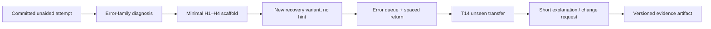

# Этап 4A — продуктовая стратегия Arvexo Arena

**Дата решения:** 20 июля 2026 года  
**Статус:** исследовательская рекомендация до discovery/pilot; оценки ниже — приоритизационные гипотезы, а не факты рынка  
**Связанные материалы:** [рынок и конкуренты](./01_market_and_competitors.md), [failure cases](./01_failure_cases.md), [learning science](./02_learning_science.md), [геймификация](./02_gamification.md), [AI-наставники](./02_ai_tutors.md), [вакансии](./03_jobs_and_skills.md), [curriculum](./03_curriculum.md)

## 1. Решение в одном экране

| Выбор | Рекомендация | Что это **не** означает |
|---|---|---|
| Primary audience | Русскоязычные студенты 18–23 лет и недавние выпускники с базовым Python, которые собираются подаваться на первую data/ML-стажировку в ближайшие 3–6 месяцев | Не школьники «с нуля», не PhD research interns и не все junior-роли сразу |
| Positioning | **«Практический тренажёр к первой ML/data-стажировке: находит конкретный пробел, учит исправлять ошибку и оставляет проверяемое evidence самостоятельного решения»** | Не обещание стажировки, зарплаты или признания внутреннего score работодателем |
| MVP | Узкая подготовка к стажировке: 3 семейства компетенций, employer-shaped задачи, delayed unseen checks и маленький versioned evidence bundle | Не полный курс C01–C16, не job board, не marketplace и не «AI Coach для всего» |
| Core loop | `ошибка → диагноз → минимальная опора → новый вариант без опоры → T14 unseen transfer → объяснение → versioned artifact` | Не линейное «посмотрел урок → получил XP» |
| Immediate wow | После содержательной ошибки пользователь решает **структурно новый**, а не тот же, вариант самостоятельно и видит, какая конкретно ошибка перестала повторяться | Не конфетти, badge или резкий рост best score |
| Culminating wow | Reviewer за ≤10 минут воспроизводит артефакт и видит отдельно assisted, independent, delayed и transfer evidence | Не «неподделываемый сертификат»: доверие и predictive validity ещё нужно доказать |
| North-star learning outcome | **`T14 Independent Transfer Confirmation Rate`** — доля начатых целевых компетенций, подтвердивших no-hint результат на валидной параллельной unseen-форме через 14 дней | Не DAU, completion, XP, рейтинг, chat messages или immediate pass rate |

Решение не следует читать как найденный product–market fit. Оно выбирает **самый дешёвый следующий способ уменьшить неопределённость** между четырьмя связанными гипотезами: есть срочная боль; proposed loop улучшает самостоятельный перенос; пользователь возвращается ради следующего evidence; внешний reviewer понимает артефакт. Ни одна из четырёх пока не доказана данными Arena.

## 2. Evidence boundary: на чём стоит решение

### 2.1 Что является наблюдением

1. **Категория переполнена.** 59-family competitor matrix показывает зрелые предложения в content, structured learning, practice/screening, competitions и AI assistance. Это делает «курсы + задачи + чат» слабой дифференциацией [S034–S035].
2. **AI-тема массовая, но не равна карьерному спросу.** В ЕС 63,8% людей 16–24 лет использовали GenAI в 2025 году, 39,3% — для формального образования; в российском анализе ОРС лишь 4,9% занятых назвали AI-навыки необходимыми в текущей работе. Эти показатели имеют разные populations/constructs и намеренно сохранены как противоречие, а не сложены в TAM (S007, S013; [Eurostat](https://ec.europa.eu/eurostat/web/products-eurostat-news/w/edn-20260210-1), [НИУ ВШЭ/Росстат](https://issek.hse.ru/news/1170639437.html)).
3. **Узкий школьный соревновательный интерес наблюдаем.** Профиль НТО AI получил более 7,5 тыс. регистраций в сезоне 2024/25, но это не active learners, WTP или спрос на отдельную Arena (S014; [Минобрнауки](https://www.minobrnauki.gov.ru/press-center/news/nauka-i-obrazovanie/97242/)).
4. **Job snapshot поддерживает workflow, а не универсальный syllabus.** Целевая выборка официальных вакансий подчёркивает Python/data/SQL/statistical reasoning/evaluation/reproducibility и role-specific ветви; она не является census, переоценивает big-tech/research и не доказывает причинность найма [S037; JS001–JS069]. Частоты отдельных semantic flags не используются как standalone product proof.
5. **Наиболее защищённый учебный контур требует независимого delayed evidence.** Retrieval, feedback, spacing и transfer поддерживают последовательность «самостоятельная попытка → feedback → вариант → отложенная невиданная проверка»; assisted performance, completion и best score должны храниться отдельно [S036; ES-L01–ES-L54].
6. **AI Coach и leaderboard могут улучшать активность без обучения.** Для AI-tutoring перенос на Arena не установлен; ступенчатые подсказки должны сравниваться со static hints по unaided transfer. Gamification должна иметь learning guardrail, особенно для нижнего квартиля подготовки [S020–S021, S036; ES-G01–ES-G33, ES-A01–ES-A45].
7. **Career claim и public portfolio создают trust/regulatory surface.** Enforcement против misleading placement claims и история privacy failures требуют прозрачных знаменателей, provenance, consent и отсутствия гарантий [S023–S025].
8. **Текущий продукт — literacy/quiz/tournament seed, не career trainer.** В current branch есть один AI Track, базовый турнирный контур и 17 поддерживаемых типов заданий, но нет Python/SQL/notebook execution, delayed scheduler, AI Coach, verified portfolio, provenance или employer workflow; production audit отдельно зафиксировал content drift и повтор practice questions [S001–S002, S006].

### 2.2 Что остаётся гипотезой

- Срочность подачи на стажировку даст более сильное добровольное возвращение, чем общий интерес к AI.
- Ошибка в validation/metrics/data workflow достаточно часта и болезненна, чтобы пользователь выбрал Arena вместо ChatGPT, Stepik, Kaggle или pet project.
- Версионированный evidence bundle будет понятен внешнему reviewer и добавит signal сверх обычного GitHub-репозитория.
- Можно обеспечить полезную вариативность задач при приемлемой стоимости authoring/review.
- Пользователь или плательщик заплатит за cohort/review/assessment, хотя базовый practice остаётся бесплатным.
- `T14 Independent Transfer Confirmation Rate` окажется надёжной, доступной и справедливой метрикой именно для этой аудитории.

До проверки эти формулировки разрешены только как `H` (hypothesis). В таблицах ниже `E` означает evidence anchor из этапов 1–3, но **не** доказательство эффективности Arvexo.

## 3. Модель оценки позиционирований

Оценка сделана в два прохода: сначала market/learning (`B, C, D, H, R, M`), затем delivery/economics (`F, V, $, S`). Итоги сведены только после фиксации исходных баллов. Это уменьшает, но не устраняет авторскую предвзятость.

Шкала везде `1–5`, где `5` — привлекательнее. Поэтому отрицательные критерии инвертированы: `H=5` означает меньше прямого конкурентного давления, `F=5` — проще реализовать, `S=5` — риск лучше контролируется.

| Код | Критерий | Вес | 1 | 5 |
|---|---|---:|---|---|
| `B` | Severity/frequency решаемой проблемы | 10% | nice-to-have/редко | срочно и повторяется |
| `C` | Ясность обещания для аудитории | 10% | нужно долго объяснять | понятно за одну фразу |
| `D` | Дифференциация | 12% | commodity | редкая защищаемая связка |
| `H` | Конкурентный headroom | 8% | incumbents закрывают loop | сравнительно свободная связка |
| `F` | Реализуемость текущей командой/продуктом | 12% | новая operating model | близко к текущим assets |
| `V` | Time-to-value | 10% | месяцы до сигнала | содержательная ценность в первую сессию |
| `$` | Правдоподобие монетизации | 10% | непонятен плательщик | срочный JTBD и понятный payer |
| `R` | Retention mechanism | 10% | одноразовый use | естественная повторная practice |
| `S` | Контролируемость риска | 10% | high-stakes/неуправляемый | ограничиваемый пилотом |
| `M` | Соответствие миссии | 8% | слабое | прямой доступ к реальному обучению |

Формула: `Score = Σ(raw_score / 5 × weight)`, диапазон `0–100`. Разница в 2–5 пунктов не является измеренной рыночной разницей; это приоритет следующего теста.

## 4. Scorecard: все 10 обязательных вариантов

| ID | Позиционирование | B | C | D | H | F | V | $ | R | S | M | Итог /100 | Статус |
|---|---|---:|---:|---:|---:|---:|---:|---:|---:|---:|---:|---:|---|
| P4 | Путь к первой ML-стажировке | 5 | 5 | 4 | 3 | 3 | 5 | 4 | 4 | 3 | 5 | **81,6** | рекомендовать для discovery/MVP |
| P3 | LeetCode для ML | 5 | 4 | 4 | 2 | 3 | 5 | 3 | 5 | 3 | 4 | **76,4** | product archetype, не lead claim |
| P5 | Олимпиадная AI Arena | 4 | 5 | 3 | 2 | 3 | 4 | 3 | 4 | 2 | 5 | **69,6** | резервный segment pilot |
| P6 | Verified ML portfolio | 4 | 4 | 5 | 4 | 2 | 2 | 4 | 3 | 2 | 4 | **67,6** | phase 2 после trust test |
| P10 | Практика через турниры | 4 | 4 | 3 | 2 | 3 | 4 | 3 | 4 | 2 | 5 | **67,6** | mechanic, не основной JTBD |
| P1 | Duolingo для AI | 3 | 5 | 2 | 2 | 3 | 5 | 2 | 4 | 3 | 5 | **67,2** | понятная метафора, слабый moat |
| P9 | Карьерная ML-платформа | 5 | 4 | 2 | 2 | 1 | 2 | 5 | 4 | 1 | 4 | **58,8** | слишком широкая operating model |
| P2 | Kaggle для начинающих | 4 | 5 | 2 | 1 | 1 | 3 | 3 | 4 | 2 | 4 | **57,2** | data/network cold start |
| P7 | AI-наставник | 3 | 4 | 2 | 2 | 2 | 4 | 2 | 3 | 2 | 4 | **55,2** | capability после content truth |
| P8 | AI-университет | 3 | 4 | 1 | 1 | 1 | 1 | 3 | 3 | 1 | 5 | **44,4** | отвергнуть как раннее positioning |

### P1 — «Duolingo для AI»

- **Аудитория и проблема:** школьник/студент-новичок хочет понятный ежедневный вход в AI без длинной теории.
- **Ясность (5):** знакомая метафора быстро объясняет короткие сессии. **Дифференциация (2) / конкуренция (2):** microlearning, streak, XP и AI-literacy уже широко доступны; копирование surface loop не создаёт moat [S034–S035].
- **Реализация (3) / TTV (5):** короткий quiz/trace возможен близко к текущему продукту, но валидный spacing, variants и mastery — нет. **Монетизация (2):** бесплатные alternatives сильны; родитель, вероятно, платит за сопровождение, не за streak. **Retention (4):** повторение естественно, но может стать reward loop без переноса.
- **Риск (3) / миссия (5):** доступность высокая; опасность — оптимизировать клики и lower-order recognition. Evidence: массовый AI use и literacy frameworks [S007–S010]; gamification contradiction [S020–S021, ES-G01–ES-G15]. **H:** ежедневный ритм улучшит T14 transfer при non-inferior wellbeing. Проверка: fixed weekly practice против daily quest при равных tasks/time.

### P2 — «Kaggle для начинающих»

- **Аудитория и проблема:** старшие школьники/студенты хотят работать с настоящими данными, но Kaggle entry cliff слишком высок.
- **Ясность (5):** метафора понятна. **Дифференциация (2) / конкуренция (1):** incumbents имеют datasets, notebooks, competition liquidity и статус; «проще Kaggle» легко копируется.
- **Реализация (1) / TTV (3):** нужны dataset rights/versioning, secure execution, hidden holdout, submission infrastructure и cold-start участников. **Монетизация (3):** возможны school/sponsor pilots; B2C WTP не показана. **Retention (4):** submissions создают repeat loop, но leaderboard может заменить learning.
- **Риск (2) / миссия (4):** leakage, copied notebooks, compute cost, public pressure minors. Evidence: competition archetype [S034–S035], privacy/gamification limits [S025, ES-G11–ES-G15]. **H:** readiness bands + capped submissions позволят новичкам учиться лучше обычного open leaderboard. Проверка: один offline classroom challenge против guided noncompetitive project.

### P3 — «LeetCode для ML»

- **Аудитория и проблема:** студент/ML candidate знает теорию, но не умеет регулярно решать дискретные employer-shaped ML/data cases.
- **Ясность (4):** привычный practice archetype, но ML-задача менее атомарна, чем algorithm puzzle. **Дифференциация (4) / конкуренция (2):** diagnosis + recovery + delayed transfer редки как единый protocol; task banks и interview platforms уже сильны.
- **Реализация (3) / TTV (5):** A0 diagnostics можно дать быстро, но credible coding/data cases требуют A1 runner и дорогого bank. **Монетизация (3):** возможна за premium review/mock screening; free practice конкурирует с большим supply. **Retention (5):** error queue и skill map создают естественный weekly loop.
- **Риск (3) / миссия (4):** teaching-to-benchmark и обеднение ML до puzzles. Evidence: market gap and job workflow [S034, S037], learning loop [ES-L01–ES-L54]. **H:** короткие cases предсказывают end-to-end work лучше обычного quiz. Проверка: correlation/added validity against later blind project task; не использовать completion как proxy.

### P4 — «Путь к первой ML-стажировке»

- **Аудитория и проблема:** студент с базовым Python перед циклом подачи не понимает свои gaps и не может показать самостоятельную работу.
- **Ясность (5):** конкретная цель и срок. **Дифференциация (4) / конкуренция (3):** не «ещё один курс», а narrow diagnostic-to-evidence protocol; крупные schools/interview products конкурируют за тот же outcome.
- **Реализация (3) / TTV (5):** первая employer-shaped diagnosis возможна в день 1; весь promise требует runner, versioned bank и reviewer workflow. **Монетизация (4):** urgency выше, возможны cohort/review/assessment; WTP ещё не проверена. **Retention (4):** application deadline и evidence milestones ограниченно, но естественно возвращают.
- **Риск (3) / миссия (5):** placement-claim temptation, неоднородность internship roles, employer distrust. Evidence: audience pain and failure cases [S023–S024, S034–S035], purposive job corpus/frameworks [S037], current gap [S006]. **H:** candidate предпочитает и оплачивает gap-to-evidence loop, а reviewer понимает результат. Проверка: paid concierge cohort + blinded artifact review, без обещания найма.

### P5 — «Олимпиадная AI Arena»

- **Аудитория и проблема:** олимпиадник 8–11 класса хочет readiness diagnosis и задачи чуть выше текущего уровня.
- **Ясность (5):** формальная цель понятна. **Дифференциация (3) / конкуренция (2):** adaptive error-repair может отличать продукт, но НТО/Сириус/кружки имеют официальный статус, экспертов и архивы.
- **Реализация (3) / TTV (4):** current tournament shell помогает, однако calibration, appeals и expert task bank обязательны. **Монетизация (3):** payer — родитель/школа за coach/cohort; сезонность высока. **Retention (4):** сезон и регулярные sets поддерживают cadence.
- **Риск (2) / миссия (5):** без официальной калибровки слово «олимпиадная» создаёт ложное ожидание; рейтинг может вредить слабым. Evidence: 7,5 тыс.+ AI-profile registrations [S014], competition safety [ES-G11–ES-G25]. **H:** targeted practice улучшит anchor-set readiness и не повысит withdrawal lower-baseline learners. Проверка: партнёрский 4-недельный diagnostic pilot, не публичная олимпиада.

### P6 — «Verified ML portfolio»

- **Аудитория и проблема:** candidate с pet project не может доказать process, authorship, reproducibility и независимость.
- **Ясность (4):** результат понятен после короткого explanation. **Дифференциация (5) / конкуренция (4):** связка provenance + blind reproduction + defense + delayed evidence редка; GitHub/Kaggle/Credly закрывают отдельные части.
- **Реализация (2) / TTV (2):** нужны artifact schema, runner, reviewer calibration, appeals/privacy; value появляется после проекта. **Монетизация (4):** assessment/review может быть платным. **Retention (3):** milestones редкие; это скорее culmination, чем daily loop.
- **Риск (2) / миссия (4):** reviewer cost, bias, forgery и отсутствие employer recognition. Evidence: curriculum verification design [S037; CUR-I01–CUR-A01], portfolio mention is only a directional signal. **H:** blinded reviewer принимает лучшее решение или быстрее review с bundle. Проверка: crossover review обычного repo и bundle; измерять time, reliability и decision change.

### P7 — «AI-наставник»

- **Аудитория и проблема:** learner застревает и не получает своевременного feedback.
- **Ясность (4):** термин известен. **Дифференциация (2) / конкуренция (2):** general assistants и bundled tutors сильнее по модели/distribution; преимущество возможно только в task truth/policy/evidence.
- **Реализация (2) / TTV (4):** ответ появляется быстро, но безопасная H0–H5 система требует content truth, eval set, fallback, cost/privacy controls. **Монетизация (2):** variable cost и бесплатные alternatives. **Retention (3):** помощь может вернуть пользователя либо сформировать dependency.
- **Риск (2) / миссия (4):** answer leakage, hallucination, minors privacy, assisted pass as mastery. Evidence: tutor literature/product audit [S036; ES-A01–ES-A45]. **H:** task-scoped hints превосходят author-approved static hints по T14 unaided transfer. Проверка: randomized bounded-skill trial; chat satisfaction не primary.

### P8 — «AI-университет»

- **Аудитория и проблема:** любой learner хочет единый путь от zero до career/research.
- **Ясность (4):** амбиция ясна, exit contract — нет. **Дифференциация (1) / конкуренция (1):** Coursera/edX/Практикум/DataCamp/free curricula имеют content, brand и distribution.
- **Реализация (1) / TTV (1):** одновременно curriculum, faculty, assessment, community, credential и career services. **Монетизация (3):** broad subscription теоретически возможна, но CAC/support exposure высок. **Retention (3):** длинный путь даёт возвращение только при высокой completion support.
- **Риск (1) / миссия (5):** scope failure и смешение literacy/career/olympiad outcomes. Evidence: consolidation and failure cases [S022, S026–S029], current curriculum gap [S001–S006]. **H:** отсутствует sufficiently narrow falsifiable claim; поэтому не тестировать как MVP.

### P9 — «Карьерная ML-платформа»

- **Аудитория и проблема:** candidate хочет обучение, portfolio, вакансии, mentoring и путь до оффера.
- **Ясность (4):** career outcome понятен. **Дифференциация (2) / конкуренция (2):** bootcamps, schools, job boards и screening vendors уже объединяют части journey.
- **Реализация (1) / TTV (2):** двусторонний marketplace, employer sales, legal/fairness, placement measurement и long-cycle outcome. **Монетизация (5):** потенциально высокий ticket/B2B, но это plausibility, не WTP. **Retention (4):** hiring cycle создаёт cadence, после оффера пользователь уходит.
- **Риск (1) / миссия (4):** deceptive outcome pressure и operational breadth. Evidence: CFPB/FTC cases [S023–S024]. **H:** employers/payors fund screening evidence before Arena has validity. Сначала отвергнуть; вернуться только после independent evidence demand.

### P10 — «Практика через турниры»

- **Аудитория и проблема:** школьник/студент хочет deadline, challenge и peer context вместо одиночного курса.
- **Ясность (4):** формат понятен, учебный outcome менее ясен. **Дифференциация (3) / конкуренция (2):** readiness-banded error-repair event отличается от raw leaderboard, но competitions имеют strong network effects.
- **Реализация (3) / TTV (4):** shell существует; нужны fair scoring, bank separation, appeals, integrity и enough cohort. **Монетизация (3):** school/sponsor event возможен. **Retention (4):** сезоны дают recurrence, но novelty/pressure могут исчерпаться.
- **Риск (2) / миссия (5):** скорость/guessing, cheating, anxiety и status inequality. Evidence: current product [S006], mixed competition evidence [ES-G01–ES-G33]. **H:** tournament adds practice without degrading T14 transfer or lower-quartile retention. Проверка: tournament framing против identical noncompetitive task set.

## 5. Sensitivity и устойчивость решения

### 5.1 Четыре набора весов

Векторы в порядке `B, C, D, H, F, V, $, R, S, M`: Base `[10,10,12,8,12,10,10,10,10,8]`; Learning-first `[8,5,10,5,10,8,4,10,15,25]`; Founder-speed `[8,8,8,5,25,20,8,7,6,5]`; Revenue-first `[10,8,8,7,8,8,25,15,6,5]`. Каждый вектор суммируется до 100%.

| Сценарий | Изменение приоритета | P4 | P3 | P5 | P6 | P10 | P1 | P9 | P2 | P7 | P8 | Победитель |
|---|---|---:|---:|---:|---:|---:|---:|---:|---:|---:|---:|---|
| Base | веса §3 | 81,6 | 76,4 | 69,6 | 67,6 | 67,6 | 67,2 | 58,8 | 57,2 | 55,2 | 44,4 | P4 |
| Learning-first | mission 25%, risk 15%, learning/differentiation выше economics | 83,2 | 77,4 | 73,2 | 66,8 | 72,2 | 73,4 | 58,2 | 59,6 | 58,8 | 51,8 | P4 |
| Founder-speed | feasibility 25%, TTV 20%, mission 5% | 81,0 | 77,2 | 70,0 | 59,8 | 68,4 | 70,4 | 51,4 | 52,4 | 56,2 | 38,0 | P4 |
| Revenue-first | monetization 25%, retention 15% | 82,0 | 76,0 | 69,2 | 69,8 | 67,6 | 63,4 | 69,4 | 60,4 | 53,4 | 48,8 | P4 |

P4 остаётся первым во всех четырёх сценариях и во всех десяти leave-one-criterion-out пересчётах. Base-margin над P3 — 5,2 пункта; изменение одного raw score на ±1 меняет итог максимум на 2,4 пункта, поэтому одиночная умеренная ошибка оценки не меняет победителя. Две совместные ошибки уже могут изменить порядок — score не заменяет discovery.

### 5.2 Где результат может сломаться

P4 перестаёт быть рекомендацией, если выполняется хотя бы одно:

- из 15–20 problem interviews менее трети описывают повторяющуюся самостоятельную practice/feedback боль **до** показа концепта;
- кандидатам нужен прежде всего referral/accountability, а не diagnostic/evidence;
- reviewer не понимает bundle или не меняет решение быстрее/лучше обычного repo;
- стоимость одного нового валидного task family + maintenance делает бесплатный core невозможным;
- 3–6-месячный hiring cycle слишком узок/сезонен для повторяемого acquisition;
- сама формулировка «к стажировке» вызывает ожидание placement guarantee, которое нельзя этично контролировать.

## 6. Почему P4, а не просто P3

`LeetCode для ML` — полезная **product metaphor**: task-first, быстрый committed attempt, повторяемый банк. Но как lead positioning она говорит о форме продукта, а не о результате пользователя. P4 даёт ясный момент потребности, ограничивает curriculum и позволяет измерить time-to-evidence. Внутри P4 используется P3-механика, а не наоборот.

Остальные варианты отклонены **как первая ставка**, не навсегда:

| Вариант | Причина отклонения сейчас | Условие возврата |
|---|---|---|
| P1 Duolingo | commodity surface и риск activity≠learning | T14 non-inferiority + repeatable free acquisition у novice cohort |
| P2 beginner Kaggle | runner/data/network cold start | один partner dataset, secure holdout и teacher cohort |
| P5 Olympiad | нужен expert-calibrated bank/официальный context | partner/SME + anchor calibration + appeal process |
| P6 Portfolio | trust/reviewer cost появляется поздно | обычный MVP создаёт воспроизводимые artifacts; reviewers value bundle |
| P7 Tutor | generic coach commoditized; content truth не готов | static baseline, golden set и bounded skill trial |
| P8 University | scope не falsifiable за один цикл | никогда как MVP; только portfolio of validated tracks |
| P9 Career platform | двусторонний cold start и outcome liability | доказанный candidate signal + минимум 3 repeat employer reviewers |
| P10 Tournaments | mechanic подменяет JTBD | learning-equivalent tasks show no harm and add voluntary return |

## 7. Product contract рекомендуемого позиционирования

### 7.1 Primary audience и exclusions

**Включать в первый pilot:** 18–23 года; базовый Python (read/write functions, lists/dicts, simple data loading); план подачи на data/ML internship в 3–6 месяцев; готовность уделять 2×45 минут в неделю и пройти T14 follow-up.

**Не включать в первый pilot:** полный zero-to-code; дети младше 16; PhD research interns; candidates, которым нужен только SQL analyst interview; пользователи, требующие гарантированного placement; high-stakes employer screening без validated instrument.

Такой exclusion не определяет конечную миссию. Он уменьшает variance первого теста и не смешивает несовместимые strata, обнаруженные в job corpus [S037].

### 7.2 JTBD и обещание

> Когда я готовлюсь подаваться на первую data/ML-стажировку и не понимаю, где мои практические пробелы, помоги быстро увидеть конкретную ошибку, исправить её на новой задаче и собрать честное доказательство того, что я могу повторить результат самостоятельно.

Разрешённая формулировка до пилота: **«Практикуйся на задачах, похожих по операциям на entry-level workflow; получай прозрачное evidence своих попыток»**.

Запрещённая формулировка: **«Получи стажировку», «работодатели доверяют рейтингу», «подтверждённый industry skill»**. Для career outcome нужны заранее опубликованные denominators и независимая проверка [S023–S024].

### 7.3 Core loop и два wow-момента



- **Immediate wow:** «Я не просто увидел ответ — я только что решил другую задачу без подсказки и вижу, какую ошибку исправил».
- **Culminating wow:** «Мой результат воспроизводим; reviewer видит условия, помощь, unseen check и ограничения, а не только красивый notebook».

### 7.4 North star и guardrails

```text
T14 Independent Transfer Confirmation Rate
  = count(started learner×competency pairs meeting all T14 no-hint unseen gates)
    / count(valid started learner×competency pairs)
```

Показывать рядом:

- activation denominator и долю дошедших до T14;
- median learner-minutes до confirmation;
- pre-to-T14 change на parallel forms;
- assistance distribution и повтор critical-error families;
- lower-baseline/accessibility gaps, attrition и wellbeing;
- task/form version и uncertainty.

`T14`, конкретные gates и пороги — pilot conventions, не научные константы [ES-L01–ES-L54]. North star не должен расти за счёт более лёгких forms, удаления слабых пользователей из знаменателя или навязывания hints.

## 8. Разрыв с текущим продуктом и порядок устранения

| Контур | Текущее наблюдаемое состояние | Нужно для P4/MVP | Решение |
|---|---|---|---|
| Product truth | Master TZ, local seed и production snapshot расходятся; production audit видел повтор practice questions | versioned curriculum/task truth и release manifest | **Сначала** |
| Content banks | learning/practice/tournament используют близкий content; unseen guarantee отсутствует | отдельные learning/recovery/probe/certification banks; family/exposure tags | **Сначала** |
| Attempt evidence | basic attempts/best score; возможен last-attempt state tension | committed first response, assistance code, provenance, immutable event history | **Сначала** |
| Delayed learning | scheduler/queue отсутствует | T14 queue, parallel forms, attrition logging | **Сначала** |
| Task engine | 17 schema types, но seed использует 3; `code_text/code_fix` не исполняют Python | использовать A0 для concept/trace/table; один sandboxed runner с hidden tests для claim о coding | A0 pilot → A1 gate |
| Diagnosis | нет validated misconception taxonomy | 3 families: split/leakage, metric/validation, data/debug reasoning; expert labels | **Сначала** |
| AI Coach | отсутствует | static author-approved hints baseline; AI only later behind policy/eval | **Отложить** |
| Tournament | basic shell есть | не нужен core loop; возможен later framing test | **Не блокирует MVP** |
| Portfolio | отсутствует | private evidence receipt/export; не публичный marketplace | thin export в MVP |
| Employer | отсутствует | 8–15 blinded reviewer tests, не интеграция/job board | concierge research |
| Analytics | нет learning telemetry/causal instrument | event schema, form/version, delay, hints, subgroup-safe guardrails | **Сначала** |

Самый быстрый путь — не строить все будущие контуры. Сначала A0-задачи могут проверить **problem comprehension, committed attempt, diagnosis, recovery и voluntary return**. Но продукт не имеет права заявлять Python/ML coding readiness до безопасного A1 runner и reproducible artifact [S006; CUR-I01–CUR-I03].

## 9. Feature → problem → hypothesis → audience → metric → test

Все строки — falsifiable hypotheses. `Build` означает часть narrow MVP; `Pilot` — feature flag/concierge; `Defer` — не строить до указанного gate.

| Feature | Проблема | Гипотеза | Аудитория | Primary metric | Дешёвый тест / kill | Решение |
|---|---|---|---|---|---|---|
| Goal/date onboarding | generic path не отражает deadline | явная цель и дата повышают relevance первой задачи | internship candidate | first meaningful task ≤20 мин | clickable onboarding; kill если >20% не понимают path | Build |
| 12–20-min diagnostic | learner не знает gap | короткий mixed set выдаёт actionable family, а не «низкий score» | candidate | agreement with expert interview; completion | concierge expert diagnosis vs algorithm label; kill при систематических false labels | Build |
| Committed first response | hint скрывает исходное знание | фиксация до feedback улучшает интерпретацию evidence | все learners | valid unaided evidence rate | usability/A-A; kill если UX errors делают datum невалидным | Build |
| Error-family taxonomy | generic feedback не лечит misconception | 3 expert-defined families лучше направляют next task | candidate | label precision + recurrence | double-label 50–100 attempts; pause если agreement <0,7 | Build |
| Static H1–H4 ladder | direct answer создаёт dependence | минимальная author-approved опора повышает independent fix | lower baseline | next-variant no-hint pass | static ladder vs full explanation; stop при lower T14 | Build baseline |
| AI-generated hint | static hint не покрывает контекст | scoped generation улучшает transfer/cost trade-off | stuck learners | T14 transfer, leakage, cost | только после static baseline; kill при critical factual/leakage breach | Defer |
| Mandatory recovery variant | assisted pass выглядит как mastery | новый no-hint variant честнее предсказывает T14 | все learners | calibration/Brier; later pass | model with/without recovery evidence | Build |
| Error queue | исправление забывается | scheduled family-level return снижает recurrence | repeat learners | ErrorRecurrence14 | paper/notification concierge; compare fixed return | Build |
| T14 unseen probe | immediate score завышает learning | delayed parallel form различает availability и retention/transfer | all activated | T14 independent transfer | follow-up incentives equal; stop claim if attrition invalidates result | Build |
| Explanation/change request | copied output не показывает reasoning | short defense adds authorship/transfer signal | candidates/reviewers | rubric reliability + later task | blinded double-score 20 explanations | Pilot |
| Private evidence receipt | completion badge непрозрачен | version/task/help/delay receipt повышает trust/comprehension | candidate/reviewer | reviewer comprehension ≤10 мин | Figma/HTML mock vs ordinary score | Build thin |
| Reproducible artifact export | screenshot/GitHub output не воспроизводим | command/tests/provenance reduce review time | candidates/reviewers | successful reproduction; minutes | concierge package on existing repos | Pilot |
| Readiness-band peer comparison | global rank демотивирует | optional nearby comparison aids return without subgroup harm | competitive subset | W2 return + T14 non-inferiority | identical set with/without local rank | Defer/Pilot |
| XP/streak | cadence слаб | effort-only signal increases practice | broad | valid practice, T14 guardrail | opt-in weekly rhythm, not loss streak | Defer |
| Public verified portfolio | employer не видит evidence | public page creates opportunity/trust | adult candidates | qualified views/decision lift | reviewer prototype first; no minors | Defer |
| Job board/matching | candidate не находит роли | evidence-to-role mapping improves applications | candidates/employers | qualified application/interview | manual list + interviews; no platform build | Defer |

## 10. Decision gates до масштабирования

### Gate 0 — problem, до кода

- 15–20 interviews, минимум три recruitment channels.
- Go: ≥7 самостоятельно описывают конкретный practice/feedback gap; ≥5 показывают recent failed attempt/artifact; ≥4 соглашаются на оплачиваемый или time-costly concierge pilot.
- Stop/reframe: ответы сводятся к «нужен referral/дедлайн/наставник», а не к diagnostic/evidence; интерес появляется только после leading pitch.

Числа — operational thresholds для решения, не статистически оценённые market rates.

### Gate 1 — loop feasibility

- 20 пользователей, 3 competency families, manual authoring допустим.
- Go: ≥14 завершают first committed task; ≥12 добровольно возвращаются; ≥10 дают T14 follow-up; нет severe safety/privacy/integrity incident; form quality проходит expert/response-process audit.
- Stop: task ambiguity или content leakage объясняют результат; lower-baseline learners систематически уходят после diagnosis; authoring cost не имеет повторно используемых families.

### Gate 2 — learning signal

- Active-control study после instrument validation; sample size — по power/MDE/attrition, не «20 потому что MVP».
- Go claim только при заранее зарегистрированном преимуществе/не меньшем результате на T14 unseen no-hint outcome, допустимом burden и отсутствии subgroup harm.
- Stop AI/gamification feature, если она повышает completion, но снижает independent transfer.

### Gate 3 — external evidence value

- 8–15 reviewers из разных role strata сравнивают обычный repo и evidence bundle вслепую/crossover.
- Go: приемлемая inter-rater reliability, понимание ≤10 минут, воспроизводимость и осмысленное изменение confidence/decision.
- Stop public verification claim, если reviewer просто доверяет бренду/оформлению либо bundle не добавляет signal.

## 11. Self-audit

- [x] Рассмотрены ровно все 10 обязательных позиционирований.
- [x] Для каждого указаны аудитория, проблема, ясность, дифференциация, конкурентность, реализуемость, time-to-value, монетизация, retention, риск и mission fit.
- [x] Все score явно названы исследовательскими оценками; отрицательные критерии инвертированы и формула раскрыта.
- [x] Есть четыре weight scenarios, leave-one-criterion-out проверка и условия rank reversal.
- [x] Evidence anchors отделены от product hypotheses; job corpus не выдан за census или hiring causality.
- [x] Выбраны primary audience, positioning, MVP, core loop, immediate/culminating wow и learning north star.
- [x] Current product gap отделяет уже существующее от требуемого; A0 не назван code execution.
- [x] Feature map содержит problem, hypothesis, audience, metric, test/kill и решение.
- [x] AI tutor, rating, XP, portfolio и career claims не выданы за доказанное learning/employer value.
- [x] Для несовершеннолетних не предложены public-by-default profile, loss mechanics или unvalidated high-stakes score.

**Red-team остаток:** scoring создан одним исследовательским контуром и не является independent user/employer judgment. P4 победил модель при заданных score, но сами score имеют низкую/среднюю уверенность. Следующее действие — Gate 0 interviews и paid/time-costly concierge test; не разработка широкой платформы.

## 12. Ключевые источники и трассировка

- `S001–S006` — internal intent/current product/runtime evidence; ограничения подробно в [реестре](./00_source_registry.md).
- `S007–S016` — официальные youth AI use, competency frameworks, российские labor/olympiad signals; прямые ссылки находятся в [реестре](./00_source_registry.md).
- `S018–S021`, `ES-L01–ES-L54`, `ES-G01–ES-G33` — completion, learning science и gamification; canonical ledger: [education_sources.md](./sources/education_sources.md).
- `ES-A01–ES-A45` — product/RCT/safety evidence AI tutors; вывод для Arena ограничен bounded-skill hypothesis: [02_ai_tutors.md](./02_ai_tutors.md).
- `S022–S030` — bankruptcy/enforcement/privacy/sunset failure cases: [01_failure_cases.md](./01_failure_cases.md).
- `S034–S035` — 59-family competitor/market ledgers: [competitor_sources.md](./sources/competitor_sources.md), [market_sources.md](./sources/market_sources.md).
- `S037`, `JS001–JS069` — 63-row purposive vacancy corpus and ACM/NASEM/O*NET/ESCO cross-checks; не census и не causal hiring evidence: [jobs_sources.md](./sources/jobs_sources.md).
