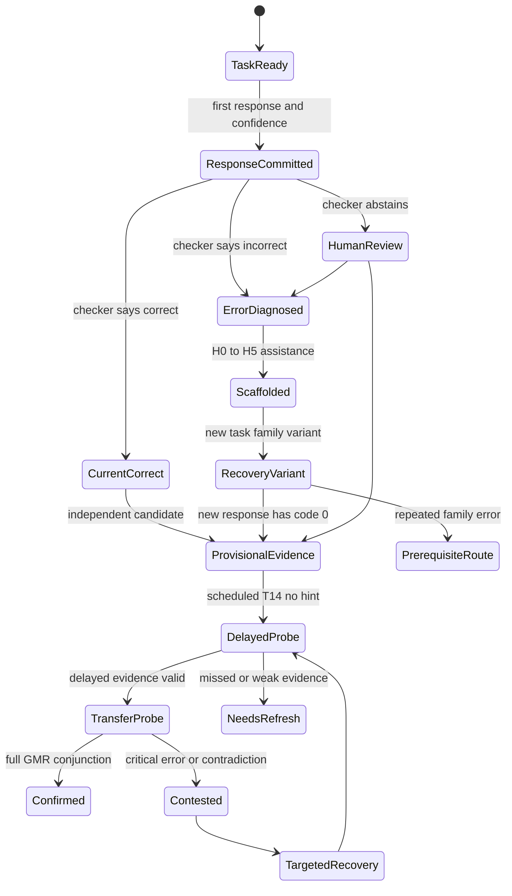
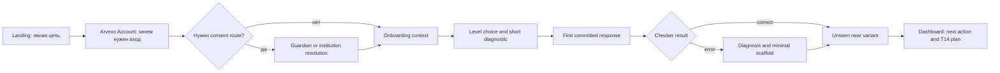
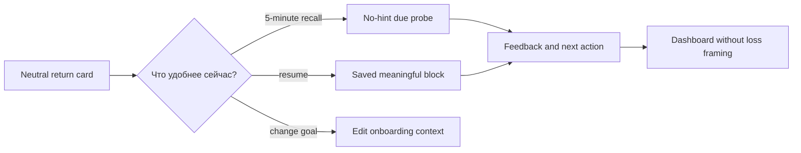

# Этап 4 — пользовательские пути и форматы заданий Arvexo Arena

**Дата среза:** 20.07.2026  
**Статус:** product-research artifact; не спецификация уже выпущенных функций  
**Область:** learner, tournament, teacher, employer и evidence journeys; без изменения продуктового кода

## 1. Решение

MVP-путь Arena следует строить не вокруг каталога уроков и не вокруг общего AI-чата, а вокруг одного наблюдаемого момента ценности:

> цель → короткая задача → зафиксированная ошибка → минимальная помощь → новый вариант без помощи → отложенная незнакомая проверка → понятное evidence

Первый «успех» — не XP, streak или красивый процент. Это ситуация, когда человек понимает свою ошибку, решает новый вариант и знает, что именно ещё предстоит подтвердить. Такая петля напрямую продолжает рыночную гипотезу этапа 1 и measurement contract этапа 2; она не доказывает learning effect до локального контролируемого теста.

Рекомендуемая последовательность интерфейсного MVP:

1. Сохранить знакомый вход: landing → Arvexo Account → цель.
2. Заменить одношаговый «выбор трека» на короткий контекстный onboarding и выбор уровня без ярлыков «слабый/сильный».
3. Дать первый диагностический блок за 5–8 минут как **плановый UX-диапазон**, а не обещание.
4. На первой ошибке показать diagnosis → H0–H3 scaffold → новый вариант; H4/H5 оставить как выход из тупика, но не как mastery evidence.
5. На dashboard показывать одно объяснимое следующее действие и отдельно: activity, rated result, learning evidence.
6. Запланировать `T14` no-hint probe; до него состояние навыка максимум `Provisional`.
7. Teacher и employer flows в первом пилоте вести как concierge/research workflows. Полноценные кабинеты, portfolio marketplace и AI interview — не learner MVP.

## 2. Метод и границы доказательности

Это **source-driven journey design**, а не визуальный аудит: в этой работе не выполнялись screenshot capture, usability sessions или accessibility conformance testing. Current product truth сверена по текущим frontend/backend surfaces, Master TZ, production audit, этапам 1–3 и сохранённому audit context. Поэтому ниже:

- **Current** означает найденную в текущем коде возможность, но не гарантирует production parity или качество контента.
- **MVP build** означает рекомендуемую новую зависимость; её нельзя описывать пользователю как уже работающую.
- **Future** означает функцию после отдельной технической, safety, legal и learning validation.
- Любая длительность, порог, приоритет или success criterion — продуктовая гипотеза до пилота.

### 2.1. Фактическая граница продукта

| Surface / capability | Current reality | Ограничение, важное для journey |
|---|---|---|
| Landing | Есть goal composer, три suggested intents, AI Track, tournaments и employer link | Recommendation основана на простых правилах по словам; это не AI Coach и не диагностика |
| Signup / login | Вход через внешний Arvexo Account; локальной регистрации/пароля нет | Return path и consent должны переживать SSO redirect; нельзя обещать локальное удаление identity без контракта с Account |
| Onboarding | Один шаг: AI Track включён, Data и Security помечены «скоро» | Нет цели, уровня, device/time constraints, accessibility choices, age/consent routing |
| Dashboard | Есть continue lesson, track completion, tournament card, weekly XP/activity | «Готовность к турниру» сейчас равна progress percent; это activity/completion proxy, не validated readiness |
| Lesson | Step wizard, сохранение `current_block`, mini-check, итоговый submit | Immediate checker есть; first committed response, confidence, assistance provenance, variant recovery и `T14` отсутствуют |
| Task engine | UI/API описывают 17 детерминированных типов | `code_text/code_fix` сравнивают текст; Python/SQL/notebook не исполняются |
| Practice | Три быстрых вопроса с immediate feedback | Банк пересекается с учебными вопросами; повтор не является unseen transfer |
| Tournament | Listing, invite/register/start/save/submit/result/leaderboard существуют | Нет доказанной калибровки, isolated certification bank, code runner или bounded AI policy внутри rated event |
| Leaderboard | Есть tournament result table | Ranking не равен learning; нужны opt-in/privacy/readiness bands и защита minors |
| Profile | XP, level, streak, arena score, track, activity; settings disabled | Нет evidence graph, privacy controls, portfolio или appeal; activity нельзя выдавать за skill |
| Employer | Есть публичная страница «раздел в разработке» | Нет employer role, search, evidence view, job brief или candidate consent |
| Teacher / school | Learner/admin roles, но teacher flow не найден | Class roster, assignment, consent status, intervention view и exports — Future |
| Portfolio | Нет | Нужны artifact/provenance/review/defense/privacy lifecycle до public claim |
| AI Coach | Нет | Landing «Спроси Arena» не tutor; bounded coach требует grounding, policy, logging, fallback и evaluation |
| Return after absence | Dashboard приветствует и lesson resume сохраняется | Нет no-shame re-entry, retention-due explanation, recap choice или missed-probe recovery |

## 3. Experience contract

### 3.1. Что интерфейс обязан разделять

| Контур | Что измеряет | Что не разрешено утверждать | Learner-facing представление |
|---|---|---|---|
| Activity | уроки, попытки, время/сессии, XP | skill, talent, employability | «Ты сделал…», без сравнительного диагноза |
| Rated competition | результат конкретного объявленного события | долговременное mastery, общий IQ, карьерная готовность | score/place + условия, форма и дата |
| Learning evidence | независимость, families, delay, transfer, critical errors | «подтверждено» по одному quiz или assisted completion | `Not observed → Developing → Provisional → Confirmed / Needs refresh / Contested` |
| Artifact evidence | конкретная версия работы, воспроизводимость, review/defense | авторство по одному hash, screenshot или AI detector | компоненты evidence, ограничения, дата/версия |

### 3.2. Обязательные правила

1. Первый ответ фиксируется до любого feedback; confidence запрашивается до проверки, но не влияет на доступ.
2. Любое checker feedback — уже assistance (`assistance_code=1`); текущий corrected answer не становится независимым.
3. Помощь не стыдится и не штрафуется XP; она честно меняет класс evidence.
4. Ошибка не понижает человека. Critical error переводит claim в `Contested` и запускает targeted recovery.
5. Скорость — отдельное измерение только там, где она заявлена правилами соревнования; accessibility accommodations не снижают mastery standard.
6. Recommendation всегда имеет reason code: `prerequisite_gap`, `retention_due`, `transfer_needed`, `teacher_assigned`, `target_role_gap`.
7. Для minors профиль, рейтинг, портфолио и контакты private by default; consent/assent и применимое право проверяются по юрисдикции.
8. AI Coach не присутствует в rated/certification task. Practice помощь и assessment разделены интерфейсом и банками.
9. Нельзя обещать «internship-ready», placement или verified skill до валидной независимой формы и employer interpretation study.

## 4. Карта UX surfaces

| Surface | Главный вопрос пользователя | Рекомендуемое MVP-состояние | Empty/error/recovery | Current / future dependency |
|---|---|---|---|---|
| Landing | «Подходит ли это моей цели?» | Три явных входа: разобраться, исправить пробел, подготовиться к событию; отдельно school/employer research links | Не угадали intent → вручную выбрать цель; не маскировать rules как AI | Current можно переиспользовать; copy/intent taxonomy — MVP build |
| Signup / auth | «Зачем вход и что будет сохранено?» | До SSO: purpose, минимальные данные, возврат в исходный intent | SSO fail → понятный retry и сохранённый `return_to`; support link | Current SSO; consent/data contract — MVP build |
| Onboarding | «С чего мне начать?» | Goal, experience, age band/consent route, device, time budget, accessibility preferences; всё редактируемо | Skip разрешён; unknown не заполняется inference | Current one-step track choice нужно расширить |
| Level choice | «Не окажусь ли я в слишком лёгком/сложном?» | `Начать с основ / проверить базу / выбрать цель` + diagnostic override | Низкий результат → не ярлык, а «вот две prerequisites»; ручная смена | Future diagnostic bank and routing |
| First task | «Я понимаю, что от меня хотят?» | Goal, example/constraints, input modality, confidence, commit CTA | Invalid input → field-level recovery без раскрытия correctness | Current task components reusable; commit/confidence events — MVP build |
| First error | «Почему неверно и могу ли я исправиться?» | Misconception label простым языком, evidence, H0→H3 ladder, выбор объяснения | Feedback uncertain → `не могу надёжно проверить`, human/content report | MVP build; bounded static feedback сначала |
| First win | «Это случайность или я понял?» | Новый вариант без подсказки; показать «исправлено сейчас, проверим позже» | Variant fail → иной representation/short prerequisite, не infinite retry | Variant bank + provenance — MVP build |
| Dashboard | «Что делать дальше и почему?» | Одна primary card + reason; отдельно Learning / Arena / Activity | Нет evidence → orientation task; service fail → resume link/local state | Current shell/cards reusable; evidence states/scheduler — MVP build |
| Lesson | «Как пройти тему без click-fragmentation?» | Goal → concise model → worked example → check → application → summary; 10–15 meaningful steps как guideline | Resume exact meaningful block; content issue report | Current wizard reusable; content versioning/build required |
| Task | «Как ответить, получить помощь и понять статус?» | Same task shell for A0; desktop requirement labelled before A1 tasks | Save draft, timeout recovery, checker abstain, appeal | Current A0; A1 runners later |
| Tournament | «Стоит ли участвовать и что считается?» | Rules, topics, accessibility, practice vs rated boundary, readiness caveat, private result | Missed/connection fail policy visible до start; resumable where fair | Current basic tournament; calibrated bank/policies — MVP build |
| Leaderboard | «С кем меня сравнивают?» | Opt-in, pseudonym, readiness band, no bottom-shaming; default private for minors | Small cohort → no rank; suspicious result → review, not accusation | Current table; privacy/bands/appeal — Future after pilot |
| Profile | «Что обо мне знает система?» | Activity, rated results, learning evidence in separate tabs; export/delete/privacy controls | Sparse evidence → explain; contested evidence → probe/appeal | Current activity profile; evidence/privacy controls — MVP/Future |
| Portfolio | «Что я могу безопасно показать?» | Private draft → verified version → selective share with expiry | Failed defense keeps draft, marks claim contested; revoke link | Future: artifact, runner, review, defense, consent lifecycle |
| AI Coach | «Помоги, но не решай за меня» | Bounded task-context panel, H1–H3 first, source/uncertainty, transcript controls | No grounding/unsafe/latency → static hint or human escalation | Future after content truth and evaluation; not current landing composer |
| Mobile | «Могу ли я продолжить с телефона?» | A0/reading/retrieval fully usable; desktop-required tasks announced before start | Save/resume across device; low-bandwidth text fallback | Current responsive shell; per-format QA and sync — MVP build |
| Return after absence | «Я всё потерял?» | Neutral welcome, choose 5-min recall or resume; explain retention-due task | Missed T14 → reschedule window, no streak-loss guilt | Current resume exists; due scheduler/re-entry copy — MVP build |
| Teacher | «Кому и почему нужна помощь?» | Assignment + component evidence + reason + next action; no opaque score | Missing evidence shown as missing, not weak; override/appeal | Future role/RBAC, roster, consent, reports |
| Employer | «Можно ли быстро доверять этому evidence?» | Candidate-consented link: target skill, task/version, unaided/delayed/transfer, artifact, limits | Expired/revoked claim visible; request clarification, no direct minor contact | Current waitlist page only; evidence view — Future pilot |

## 5. Общая state machine: от ответа к mastery

`CurrentCorrect`, `RecoveryVariant` и даже одно `T14` событие не равны `Confirmed`. Полный `GMR` (**Global Mastery Rule / единое правило mastery**) требует одновременно model confidence/консервативного pilot-эквивалента, двух независимых I3 families с spacing, I4 unseen transfer, delayed evidence, valid form и отсутствия unresolved critical error [см. `02_learning_science.md`, §6.7; `03_curriculum.md`, §2.2].

### 5.1. Минимальный event contract

Каждое событие содержит `event_id`, pseudonymous `learner_id`, `occurred_at`, `session_id`, `surface`, `task_id/version`, `curriculum_version`, `purpose` (`learn/practice/probe/rated/certify`), `device_class`, `access_mode`, consent/legal-basis reference и schema version. Не писать свободный текст/PII в analytics payload.

| Event | Обязательные поля | Что можно считать | Что нельзя выводить |
|---|---|---|---|
| `entry_intent_selected` | intent, source, explicit/manual | funnel by declared intent | настоящую карьерную мотивацию без интервью |
| `auth_started/completed/failed` | return path, error class, latency bucket | SSO completion/recovery | причину ухода по одному fail |
| `consent_required/resolved` | policy version, actor type, jurisdiction rule id, result | operational compliance flow | юридическую достаточность без review |
| `onboarding_context_saved` | explicit goal, experience band, time/device choices | chosen constraints | disability, wealth, ability inference |
| `response_committed` | response hash/value ref, confidence, assistance_code=0, item exposure | independent candidate opportunity | mastery |
| `checker_result` | scorer/version, result, uncertainty/abstain, error family | current performance/error | authorship or durable learning |
| `assistance_exposed` | code 1–6, source/static/model version, content hash, latency | help burden | causal hint benefit without randomization |
| `recovery_variant_started/completed` | family relation, novelty/exposure, assistance timeline | immediate error repair | delayed retention |
| `probe_scheduled/completed` | T-window, family, I-class, form/version | retention opportunity/outcome | «исправился» у learner без opportunity |
| `artifact_version_submitted` | commit/data/env hashes, declared help, contributors | exact version lineage | authorship by hash alone |
| `review/defense_completed` | rubric/version, reviewer conflict, accommodation, result/appeal | adjudicated component evidence | personality, honesty from voice/gaze |
| `tournament_*` | rules version, rated flag, attempt timestamps, result | event result | general mastery |
| `share_link_created/revoked` | scope, expiry, consent actor, fields | sharing lifecycle | implicit permission to index/contact |

## 6. Recommended MVP flows и состояния экранов

### 6.1. F1 — activation через первую исправленную ошибку

Screen-state contract:

- **Before answer:** one task goal, constraints, answer control, optional confidence, explicit `Зафиксировать ответ`; no correctness leakage from button colors or option order.
- **After incorrect:** `Где разошлось рассуждение` → evidence/counterexample → `Попробовать самому` / H1 / H2 / H3; full solution separated under `Показать решение — текущая попытка будет учебной`.
- **After correct:** brief explanation plus `Проверим на другом случае`; no confetti/XP that competes with reflection in the first test.
- **After recovery:** `Сейчас получилось самостоятельно на новом варианте. Статус: Provisional; проверка через 14 дней`.
- **Dashboard:** one primary action with reason and alternative: `Закрепить ошибку из validation` / `Продолжить урок`; activity and competition are secondary tabs.

Primary activation metric: share of consent-eligible starters who complete one recovery variant, with denominator and time burden. Learning endpoint remains unaided `T14` + unseen transfer, not activation.

### 6.2. F2 — возврат после паузы

Не показывать «ты всё забыл», красный потерянный streak или ложный дедлайн. Missed `T14` означает `evidence overdue`, а не failed learner; система предлагает следующее валидное окно и объясняет, почему probe нужен.

### 6.3. F3 — турнир без подмены обучения рейтингом

`Event details → eligibility/consent/accessibility → rules and rated boundary → optional matched practice → locked rated attempt → result components → private debrief → optional pseudonymous leaderboard → targeted learning route`.

До start видны: topics, duration, scoring, tie-break, allowed tools, reconnect/auto-submit policy, accommodations, data visibility, appeal. AI Coach отсутствует внутри rated attempt. После result сначала показывается разбор по task families и только затем opt-in rank; для minors public rank выключен по умолчанию.

### 6.4. F4 — verified artifact, не «галерея красивых проектов»

`Versioned brief → private workspace → declared assistance log → deterministic checks → submit exact version → blinded rubric → individual I4 change/defense → private verified record → selective fields + expiry → revoke/supersede`.

В learner MVP этот flow можно симулировать concierge-проверкой одного артефакта. Public profile, searchable candidate database и automated high-stakes project grading остаются Future.

### 6.5. F5 — bounded AI Coach

`Task context → learner goal → retrieve approved concept/error card → policy chooses H1/H2/H3 → grounded response with uncertainty → learner commits new variant → session summary → transcript retention choice`.

Если retrieval пуст, safety срабатывает, latency/cost cap превышен или verifier не уверен: статическая подсказка, content report либо human escalation. Coach не придумывает score, не меняет mastery и не обещает конфиденциальность несовершеннолетнему. В первой версии предпочтительнее validated static hint ladder; generative layer — отдельный experiment.

## 7. Journey 1 — школьник 7–11 класса

**Trigger.** Ссылка от учителя/родителя, подготовка к уроку/турниру или собственный интерес к AI.  
**JTBD.** «Помоги понять, что я уже умею, исправить один реальный пробел и продолжить без ощущения, что меня ранжируют как человека».  
**Desired outcome.** Первая самостоятельная recovery-задача, понятный следующий шаг и безопасный return path; `Confirmed` только после GMR.

| Шаг | Screen, действие и решение | Эмоция / риск | Value moment, failure и recovery | Events / метрики | Current vs future |
|---:|---|---|---|---|---|
| 1 | Landing: выбрать «разобраться» / «подготовиться» или написать цель; вручную исправить рекомендацию | Любопытство; риск непонятного обещания и «AI magic» | Value: видит конкретный 5–8-min next step; rules ошиблись → manual intent | `entry_intent_selected`; goal→auth rate по intent | Landing Current; transparent intent MVP |
| 2 | До SSO увидеть зачем аккаунт, что сохраняется и куда вернёт; пройти Arvexo Account | Боязнь регистрации; потеря контекста при redirect | SSO fail → retry с тем же `return_to`, без повторного ввода цели | `auth_*`; recovery completion, not raw conversion only | SSO Current; durable intent MVP |
| 3 | Age band и jurisdiction route; при необходимости guardian/institution consent + learner assent | Риск скрытого сбора возраста, семейного давления | Можно выйти и изучать публичный demo без профиля; consent granular/revocable | `consent_*`; unresolved count, support time | Consent orchestration Future/MVP gate |
| 4 | Onboarding: цель, опыт, язык/representation, устройство, доступное время; «не знаю» допустимо | Страх ярлыка; accessibility disclosure | Все ответы editable; не спрашивать диагноз/доход | `onboarding_context_saved`; skip/edit rate | Current only track choice; context MVP |
| 5 | Level choice: основы / проверить базу / цель; 3–5 diverse items без rank | Тревога из-за теста | Ошибка → prerequisite card, не «низкий уровень»; сменить путь вручную | diagnostic completion, item nonresponse, burden | New diagnostic bank MVP |
| 6 | Первая задача: confidence → commit; при ошибке H0/H1/H2/H3 → новый вариант | Фрустрация; желание открыть ответ | **First value:** объяснил ошибку и решил новый вариант; checker uncertain → abstain/report | `response_committed`, `assistance_exposed`, recovery rate | A0 shell Current; provenance/variants MVP |
| 7 | Dashboard: одна reasoned recommendation; выбрать lesson или 5-min practice | Облегчение; риск XP заменить цель | Learning/Activity/Arena раздельны; alternative always available | next-action acceptance; unaided opportunities | Dashboard Current; evidence cards MVP |
| 8 | Lesson: 10–15 meaningful steps, check/application/summary; save/resume | Усталость от click fragmentation | Exit сохраняет смысловой блок; resume preview | block completion, task time, exit/re-entry | Wizard Current; content restructure MVP |
| 9 | Опциональный tournament: правила, readiness caveat, pseudonym, private rank | Competition anxiety, exposure | Practice без штрафа; отказаться без потери курса; result → learning debrief | register→start; anxiety/quit; report rate | Basic tournament Current; safeguards Future |
| 10 | Возврат через 7–21 дней: neutral recall/resume; `T14` no-hint probe | Стыд за паузу | Missed window rescheduled; no streak loss framing | return-to-meaningful-action; T14 completion/outcome | Resume Current; scheduler/probe MVP |

**Safeguards.** Private profile/rank; no free DMs; no public school/class comparison; guardian/teacher sees only policy-approved component evidence, not raw AI transcript by default; delete/export and retention controls; keyboard/screen-reader/reflow testing; text alternative to drag, graph and oral modes. Применимый age threshold нельзя универсально задать без юрисдикционного legal review [ES-G26–ES-G28; ES-A28–ES-A29].

**Primary journey metrics.** First-recovery completion; `T14` unaided transfer with denominators; burden and dropout; low-baseline/accessibility subgroup gaps; safety/privacy incidents. XP, session count и NPS — secondary diagnostics.

## 8. Journey 2 — олимпиадник

**Trigger.** Ближайший AI/ML турнир, школьный отбор, желание понять слабые темы.  
**JTBD.** «Покажи мою готовность к конкретному формату, дай честную тренировку и не смешивай тренировочный прогресс с рейтингом события».  
**Desired outcome.** Calibrated practice plan, fair rated attempt и post-event transfer route.

| Шаг | Screen, действие и решение | Эмоция / риск | Value moment, failure и recovery | Events / метрики | Current vs future |
|---:|---|---|---|---|---|
| 1 | Public tournament card: official status, topics, form/version, date, duration, eligibility, allowed tools | Срочность; риск fake event/ambiguous rules | Event draft/cancelled clearly labelled; subscribe without forced signup | event view→rules view; question rate | Public tournament surface partial Current |
| 2 | Login/consent; choose pseudonym and leaderboard visibility before register | Exposure anxiety | Default private for minor; visibility reversible до lock | consent/visibility events | Auth Current; visibility Future |
| 3 | Readiness diagnostic aligned to blueprint, not track completion percent | Overconfidence/underconfidence | Show component gaps + uncertainty; «недостаточно данных» valid | calibration/Brier cohort only; diagnostic burden | Validated form Future; current percent prohibited as claim |
| 4 | Plan: 2–3 highest-value prerequisites, matched practice, event countdown non-coercive | Fear of missing out | Skip allowed; no XP multiplier or content lock tied to countdown | plan acceptance, practice-to-transfer | Next-action engine MVP |
| 5 | Practice arena: exact interface, distinct bank, hints permitted/logged, reconnect rehearsal | Gaming exact items | Exposure audit; compromised item removed; hints don't affect rating | exposure, help burden, recovery | UI Current; separated banks/provenance MVP |
| 6 | Pre-start check: rules acknowledgement, accessibility/accommodation, network check, save policy | High stress; accessibility disadvantage | Problem found → reschedule/support where rules allow; no silent disqualification | check pass/fail; support resolution | Future operational policy |
| 7 | Rated attempt: locked timer if applicable, autosave, no Coach, status announcements not answer clues | Pressure, connectivity | Reconnect/auto-submit policy applied consistently; incident log + appeal | start, save, reconnect, submit, incident | Basic flow Current; hardened fairness Future |
| 8 | Result: score/components, form and time; review when released | Rank fixation | Explain which outcome is competition-only; suspected cheating → review, no accusation | result viewed; appeal; review use | Result Current; component model Future |
| 9 | Optional leaderboard: pseudonym, readiness band, no bottom list; opt out | Social comparison/toxicity | Small/unsafe cohort → rank suppressed; report/block | opt-in, quit/anxiety, reports | Leaderboard Current; guardrails Future |
| 10 | Post-event route: one error family → independent variant → `T14` probe | Disappointment or complacency | Rank does not change mastery; targeted recovery available to all | error recurrence, T14 transfer | Variant/scheduler MVP |

**Primary journey metrics.** Registration→valid start, incident-adjusted completion, fairness/appeal SLA, subgroup gaps, post-event error recurrence and delayed transfer. Never optimize public-rank views as the north star.

**Accessibility/privacy/consent.** Olympiad rules must expose timer accommodations, reconnect handling and alternate input modes before registration. A school invitation does not by itself resolve every minor-consent requirement; age/jurisdiction routing is reused from Journey 1. Rank, pseudonym and review visibility are separate choices.

## 9. Journey 3 — студент

**Trigger.** Учебный курс, first data project или поиск ML/Data internship.  
**JTBD.** «Соедини мои теоретические знания с проверяемой практикой и покажи, что именно ещё нужно до первого реального артефакта».  
**Desired outcome.** One honest skill-gap map, executable work only after A1 infrastructure, and a private evidence bundle.

| Шаг | Screen, действие и решение | Эмоция / риск | Value moment, failure и recovery | Events / метрики | Current vs future |
|---:|---|---|---|---|---|
| 1 | Landing intent «собрать первый data/ML artifact»; preview requirements and desktop needs | Hope; risk of career promise | Explicitly state no placement guarantee; offer literacy-only mobile route | intent, requirement expand | Copy MVP; artifact flow Future |
| 2 | Onboarding: target track, prior Python/SQL/statistics, available device/time; link a vacancy optionally | Impostor syndrome | Self-report only chooses assessment start, never grants credit | explicit context save/edit | Context MVP |
| 3 | Diagnostic across C01/C03/C06/C09 concepts; executable skills labelled unobserved until runner task | False confidence from quiz | «Concept understood; implementation not observed» is a valid component result | component opportunities/outcomes | A0 MVP; A1 later |
| 4 | Gap map: 2 prerequisites + one choice; see why each is recommended | Overwhelm | Change target/pace; no 16-module wall by default | reason-code view/override | MVP |
| 5 | Error-repair lesson in validation/leakage/metrics | Productive challenge | **Value:** catches a non-obvious leakage case and transfers to new schema | assistance, recovery, I3 candidate | A0 MVP |
| 6 | Python/SQL/CSV task only when sandbox exists; hidden tests and resource limits visible | Tool frustration; unsafe code | Runner failure separated from learner error; save/retry; no text-match claim | compile/run/test events, infra error | Future A1; explicitly not Current |
| 7 | Project brief → milestones: data card, baseline, validation, error analysis, model card | Scope creep/copying | Template/scaffold; declare AI/peer help; individual change request | artifact version/provenance | Future artifact system |
| 8 | Bounded Coach on task context; choose H1–H3; full solution requires acknowledgement | Hint dependency | Static hint fallback; new unaided variant after help | help burden, hint experiment only | Static hints MVP; generative Future |
| 9 | Private portfolio preview: exact claims, evidence gaps, expiry; choose fields to share | Reputation/privacy | Failed review leaves draft; revise or appeal | preview/edit/share intent | Concierge pilot then Future |
| 10 | Return: T14/T30 foundation probes and project continuation | Long-course fatigue | Neutral refresh, reprioritize target | retention, time-to-confirmed, attrition | Scheduler Future/MVP gate |

**Primary journey metrics.** Share reaching one independent transfer task, T14/T30 outcomes, time/burden to component evidence, runner failure rate separate from learner error, artifact reproducibility and appeal outcomes. Completion of a long curriculum is not the primary metric.

**Accessibility/privacy/consent.** «Студент» не гарантирует совершеннолетие: age/jurisdiction routing remains active. Device constraints and accommodations are explicit inputs, not inferred traits. Project/data visibility is private until field-level sharing; speech is never required when text/code mode measures the same construct.

## 10. Journey 4 — кандидат на internship

**Trigger.** Конкретная live vacancy or upcoming application.  
**JTBD.** «Быстро сравни требования вакансии с моим evidence, закрыть один проверяемый gap и дать работодателю короткий, честно интерпретируемый work sample».  
**Desired outcome.** Candidate-controlled evidence link that improves interpretation in a blind employer test; no employability score.

| Шаг | Screen, действие и решение | Эмоция / риск | Value moment, failure и recovery | Events / метрики | Current vs future |
|---:|---|---|---|---|---|
| 1 | Paste/select official vacancy URL; snapshot date/status and role level; confirm parsed requirements | Urgency; stale/generic vacancy | Parsing uncertain → manual checklist; archived/pipeline clearly marked | role brief created/corrected | Future; jobs research gives taxonomy, not live parser |
| 2 | Candidate selects which skills to assess; sees time/device/AI policy | Fear of long test | Choose one evidence bundle; quit without penalty | bundle chosen, expected burden | Future |
| 3 | Independent precheck: versioned I3 tasks across data/validation; no AI in assessment | Test anxiety/accessibility | Accommodation request before start; technical rehearsal | valid starts, accommodations | Future validated bank |
| 4 | Gap route: one learning module and bounded practice; assistance fully allowed/logged | Stigma of help | Help changes evidence class, not account standing | assistance, recovery | MVP mechanics reusable |
| 5 | I4 work sample with unseen change; code/SQL only in hardened runner | Cheating suspicion; infra risk | Runner incident → invalidate/reschedule, not fail candidate | I4 completion, infra incidents | Future A1/assessment ops |
| 6 | Artifact/reproducibility check: data, commit, environment, metrics recomputed | Hidden local state | Failed reproduction → actionable checklist and revision | reproducibility result | Future |
| 7 | 12–20-min pilot defense range: sampled reasoning + change; accessible text/code alternative | Accent/charisma bias | Rubric excludes gaze/emotion/personality; appeal and second review sample | rubric/reliability/appeal | Concierge first; Future workflow |
| 8 | Candidate sees component record: I3/I4/T14, help disclosure, limitations, recency | Disappointment at missing badge | No composite «talent»; can keep private, retry after learning interval | record viewed, retry choice | Future evidence graph |
| 9 | Selective share: employer, fields, expiry, download/contact; revoke anytime | Loss of control | Revoked/expired status propagates; minors cannot enable direct contact | share lifecycle | Future consented links |
| 10 | Employer view comprehension check and application follow-up, only with consent | False causal placement claim | Outcome collection has denominator and nonresponse; no individual guarantee | evidence understood, interview decision, follow-up attrition | Research pilot |

**Primary journey metrics.** Employer interpretation accuracy/time on blinded evidence bundles, candidate burden, reproducibility, inter-rater reliability, subgroup gaps and appeals. Interview/offer rates are descriptive until a credible design handles selection and missing outcomes.

**Accessibility/privacy/consent.** Assessment and defense offer equivalent text/code accommodations and distinguish infra failure from candidate error. Candidates below the applicable age threshold cannot enable direct employer contact or public search; guardian/institution flow and local legal review are required. Adult candidates still receive granular sharing, expiry and deletion controls.

## 11. Journey 5 — преподаватель

**Trigger.** Нужно провести AI literacy/ML unit, дать практику или безопасный class tournament.  
**JTBD.** «За короткое время назначить проверяемую работу, понять распространённые ошибки и выбрать следующее действие без чтения каждого клика и без opaque AI score».  
**Desired outcome.** Assignment created in under a locally tested time budget, component evidence visible, one actionable intervention; no surveillance dashboard.

| Шаг | Screen, действие и решение | Эмоция / риск | Value moment, failure и recovery | Events / метрики | Current vs future |
|---:|---|---|---|---|---|
| 1 | Teacher landing/demo: subject, age, class size, device/access constraints | Procurement caution | Show exact current capability and missing code runner; request pilot | demo→pilot intent | No teacher surface Current; Future |
| 2 | Institution/teacher verification, DPA/legal route, RBAC; class created with minimal roster | Privacy/admin burden | CSV/SSO roster optional; pseudonymous codes; no marketing consent bundling | class created, admin time | Future |
| 3 | Consent status view: resolved/pending/not required with policy reason; learner assent separated | Risk of treating teacher as universal guardian | Block only data-dependent features; offer no-account classroom mode if feasible | consent resolution | Future/legal design |
| 4 | Choose versioned assignment by objective and evidence level; preview answer/accessibility modes | Content mismatch | Edit due window/representation, not mastery threshold; print/text fallback | assignment preview/publish | Future content authoring |
| 5 | Learners complete first-response→feedback→recovery; teacher sees aggregate error families | Over-monitoring, teacher bias | Small groups suppressed; no raw AI transcript by default | opportunities, recovery aggregate | Learner MVP + teacher aggregation Future |
| 6 | Dashboard separates missing, assisted, independent, delayed; reason for recommended action | Opaque algorithm | **Value:** sees one misconception cluster and assigns counterexample; override logged | intervention chosen/overridden | Future evidence model |
| 7 | Optional class tournament with readiness bands, roles and private results | Toxic comparison | Opt-out/non-ranked mode; incidents/report workflow | participation, anxiety/report | Basic tournament Current; class guardrails Future |
| 8 | Review open artifacts sample; rubric, double-score/adjudication where high stakes | Reviewer load/inconsistency | LLM may draft feedback but cannot be ground truth; abstain/escalate | review time, agreement | Future |
| 9 | Export component evidence and deletion/retention actions; no one-number grade unless institution defines mapping | Grade misuse | Export includes uncertainty, form/version and missingness | export/use/error reports | Future |
| 10 | Teacher return: due probes and class drift; archive class at term end | Notification fatigue | Digest frequency control; quiet hours; archive/delete | actionable digest rate, retention | Future |

**Primary journey metrics.** Median teacher setup/review time, intervention actionability, learner T14/TX by condition, missingness, subgroup gaps, override/appeal and privacy incidents. Dashboard views and assignment count are not sufficient value evidence.

**Accessibility/privacy/consent.** Teacher view must expose approved accommodations without exposing diagnoses; assignment alternatives preserve the target construct. Institution verification, guardian consent and learner assent are separate states, not one checkbox. Raw chat, exact response history and small-group sensitive aggregates remain restricted by purpose and role.

## 12. Journey 6 — работодатель

**Trigger.** Нужно оценить junior ML/Data candidate или предложить один bounded work sample.  
**JTBD.** «За ≤10 минут как исследовательскую гипотезу понять, что кандидат сделал самостоятельно, насколько результат переносим и где evidence ограничено — без чёрного ящика и demographic proxy».  
**Desired outcome.** Correct interpretation of component evidence and willingness to reuse the format; no marketplace ranking.

| Шаг | Screen, действие и решение | Эмоция / риск | Value moment, failure и recovery | Events / метрики | Current vs future |
|---:|---|---|---|---|---|
| 1 | Employer page: research pilot, evidence example, explicit «раздел в разработке» | Skepticism | Current page is honest; request demo, no fake candidate inventory | interest/demo request | Static page Current |
| 2 | Define role brief: must-have task outcomes, acceptable tools, rubric and review SLA | Hidden credential inflation | Arena challenges unrealistic junior mix; employer signs versioned brief | brief versioned | Concierge/Future |
| 3 | Receive candidate-consented link or blinded cohort sample; no search by protected/proxy fields | Bias/privacy | Link expired/revoked → request via candidate; no bypass | link opened/expired | Future |
| 4 | Summary: role target, evidence recency, I3/I4/T14, assistance disclosure, critical limits | Desire for one score | **Value:** understands three strongest/weakest components; no composite rank | comprehension task/time | Future prototype/research |
| 5 | Drill into task/version, rubric, code/data/env, reproduction, reviewer conflict | Verification burden | Missing provenance clearly marked; no claim rather than imputed score | evidence detail/reproduction | Future artifact system |
| 6 | Compare work sample to job criterion, not other candidates; employer records reason | Ranking bias | Structured decision notes; accessibility context without diagnosis | criterion decision/reason | Research workflow |
| 7 | Optional interview/change request from approved blueprint; candidate accommodation | Free labor, trick questions | Bounded time, no production data, no biometric/emotion scoring | interview/appeal | Future; human-led |
| 8 | Decide advance/no advance; candidate sees permitted feedback/appeal path | Harm from unexplained rejection | Employer can mark «insufficient evidence» instead of negative skill | decision/feedback | Future governance |
| 9 | Audit: false positives/negatives, subgroup outcomes where lawful, reviewer consistency | Compliance/reputation | Pause criterion if disparity/validity unresolved | audit/stop rule | Future pilot gate |
| 10 | Renew/contribute another microcase only after measured utility and candidate burden | Marketplace cold start | Employer case reviewed/licensed/versioned before use | repeat contribution/use | Future network effect |

**Safeguards.** Candidate owns sharing; no public minor search/contact; no raw transcript, talent/IQ/personality inference, class rank or opaque employability probability; clear purpose limitation and retention. Employer outcome data must never silently feed learner routing without consent and validity review.

**Primary journey metrics.** Interpretation accuracy, decision time, repeat use, rubric agreement, candidate burden/appeals and subgroup false-decision audit. Employer clicks or number of profiles viewed would reward surveillance, not trust.

## 13. Матрица 26 форматов заданий

### 13.1. Легенда

- **A0** — current deterministic engine can represent/check the core response; this does not imply validated content or unseen bank.
- **A0+** — can be represented by current primitives with authored structure/rubric, but semantic quality needs review.
- **A1** — needs sandboxed runner, files/datasets, hidden tests, resource/security controls and operational incident handling.
- **H** — human-led rubric/review; automation may assist only after validation and must abstain/escalate.
- **MVP:** `P0` learner error-repair pilot; `P1` after A1; `P2` after artifact/review operations; `Defer` until safety/validity need is proven.
- **GMR note:** no format confirms mastery alone. Eligible evidence still requires independent `I3/I4`, spacing, `T14`, valid form and no unresolved critical error.

| # | Формат | Learning value | Autograde / current reality | Cheating и evidence risk | Cost | Mobile | MVP | School fit | Career fit |
|---:|---|---|---|---|---|---|---|---|---|
| 1 | Single choice | Быстрая диагностика concept/misconception; слабый production evidence | **A0 Current**; exact option | Высокая угадываемость/exposure; shuffle, rationale variant, independent family | Low | Strong | P0 | Strong для literacy | Low alone |
| 2 | Multiple choice | Проверяет набор условий и частичные misconceptions | **A0 Current**; set equality/partial rule versioned | Cueing и leaked options; score policy explicit, unseen variants | Low | Strong | P0 | Strong | Low–medium for concept screens |
| 3 | Numeric answer | Retrieval/calculation, tolerance/unit reasoning | **A0 Current**; numeric tolerance needs config/version | Memorized result; vary inputs, require unit/assumption separately | Low | Strong | P0 | Strong | Medium |
| 4 | Text answer | Explanation, terminology, short reasoning | **A0 Current** only normalized text; semantic scoring needs H/validated scorer | Paraphrase/copy and false negatives; rubric + abstain, never text match for open mastery | Medium | Strong | P0 for bounded tokens | Strong | Medium |
| 5 | Matching | Relations: metric↔scenario, concept↔example | **A0 Current** | Pattern/exposure; randomize mapping, family variants | Low | Strong with non-drag alternative | P0 | Strong | Low–medium |
| 6 | Sorting | Process/order, pipeline, leakage chronology | **A0 Current** via sequence/group sort | Exact sequence leak; distractor/branch variants | Low | Conditional; buttons alternative | P0 | Strong | Medium |
| 7 | Fill-in | Retrieval inside code/formula/definition | **A0 Current** | Surface memorization; multiple equivalent answers/versioned parser | Low–medium | Strong | P0 | Strong | Low–medium |
| 8 | Code prediction | Mental tracing, shapes/types/control flow | **A0 Current** via `code_output`; code is displayed, not run | Public snippet/exact output; parameterized variants and explanation | Medium | Conditional for short code | P0 | Strong for older students | Medium foundation |
| 9 | Function implementation | Actual coding, contracts, edge cases | **A1 Future**; current `code_text` **does not execute code** | Copy/AI; hidden tests, new change request, provenance, I4 defense | High infra/authoring | Poor–conditional; desktop recommended | P1 | Strong for 9–11 with support | Strong |
| 10 | SQL | Relational reasoning, joins, grain, reconciliation | **A1 Future**; isolated DB + result/property checks | Copied query, destructive/PII risk; read-only sandbox, varied schemas | High | Conditional for short queries; desktop | P1 | Medium–strong | Strong analyst/ML |
| 11 | Debugging | Diagnosis from failure, counterexample and fix | **A0 partial** for choose/text; **A1** for executed fix | Memorized patch; hidden failing case + explanation + new bug family | Medium–high | Conditional | P0 structured; P1 executable | Strong | Strong |
| 12 | Code review | Detect correctness, security, leakage and maintainability risks | **A0+** structured findings; H for open review | Keyword gaming/subjectivity; anchored rubric, false-positive penalty, expert sample | Medium–high | Conditional | P0 for bounded leakage review | Strong for older students | Strong |
| 13 | Graph task | Read/construct plots, thresholds, calibration | **A0 Current** via graph point; richer charts need authoring | Visual accessibility/exact graph leak; data/table alternative, new data | Medium | Conditional; zoom/reflow | P0 | Strong | Strong |
| 14 | Table task | Grain, joins, confusion matrix, error slices | **A0 Current** via table select | Pattern/cue; vary schema/rows, keyboard semantics | Medium | Strong if responsive/table alternative | P0 | Strong | Strong |
| 15 | Metric selection | Match objective/cost/imbalance to metric | **A0+** choice + rationale | Guessing buzzword; change decision consequence, require explanation | Low–medium | Strong | P0 | Strong | Strong |
| 16 | Leakage detection | Core Arena wedge: identify leakage mechanism and repair split/pipeline | **A0+** hotspot/table/code review; A1 for pipeline test | Memorized examples; structural variants across domains/time/grain | Medium–high | Conditional | **P0 core** | Strong | **Strong** |
| 17 | Validation diagnosis | Choose split/CV, detect test selection/drift, interpret uncertainty | **A0+** scenario/table/graph; A1 for runnable experiment | Template answers; unseen domain and representation transfer | Medium–high | Conditional | **P0 core** | Strong for advanced school | **Strong** |
| 18 | Notebook | Integrated code, narrative, plots and iterative analysis | **A1 Future** + artifact provenance; not current | Hidden state/cell order/copy/AI; clean-run, environment hash, defense | Very high | Poor; view on mobile, author on desktop | P2 | Medium with device support | Strong |
| 19 | CSV task | Data loading, schema, missing/duplicates/type/grain decisions | **A1 Future**; file upload/fixture and property checks | Data exfiltration/formula injection/copied cleaning; synthetic files, sandbox | High | Conditional; inspection desktop preferred | P1 | Strong with small files | Strong |
| 20 | `predict.csv` | Competition-style reproducible inference and schema correctness | **A1 Future**; validate rows/schema/metrics/private labels | Label probing/submission spam; limits, public/private split, versioned data | High | Poor for creation; result view mobile | P1–P2 | Strong olympiad | Medium–strong |
| 21 | API task | Contracts, validation, latency/error handling, deploy thinking | **A1 Future** + isolated network/service harness | SSRF/secrets/unsafe calls/copied scaffold; deny network, secrets scan, tests | Very high | Poor; desktop | P2 | Medium advanced | Strong MLE |
| 22 | Project | Integration, planning, evidence, communication and limitations | **H + A1 Future**; no single autograde | Copy/team passenger/polish bias; milestones, declared help, individual I4/defense | Very high review | Conditional; manage/view mobile | P2 | Strong with scaffolds | **Strong** |
| 23 | Competition | Retrieval/decision under declared constraints; motivation | **Current basic tournament** for A0 tasks; calibrated forms Future | Sharing/collusion/speed/access bias; distinct bank, autosave, appeals, opt-in rank | High ops | Conditional | P0 small unranked/rated pilot | Strong if safeguarded | Medium; event-specific only |
| 24 | Oral explanation | Reveals model, trade-offs and authorship; supports defense | **H Future**; speech-to-text not ground truth | Charisma/accent/disability bias and coaching; anchored rubric, text/code alternative | High review | Strong if accessible synchronous/asynchronous modes | P2 / concierge | Strong | Strong |
| 25 | AI interview | Scalable rehearsal and adaptive follow-up hypothesis | **Future experimental**; no high-stakes autonomous score | Hallucination, prompt gaming, voice/emotion bias, privacy; fixed blueprint, human review | High variable/safety | Conditional | Defer | Low–medium | Medium for practice, not certification |
| 26 | Peer review | Evaluation skill, explanation and revision | **Future** structured rubric; expert sampling | Bad advice, copying, retaliation/status bias; anonymize, moderation, calibration | High moderation | Strong | Defer/P2 | Strong with facilitation | Medium–strong |

### 13.2. Формат не равен construct

Один и тот же UI primitive может измерять разные или вообще нецелевые навыки. `single_choice` о leakage может диагностировать recognition, но не умение построить leak-free pipeline. `code_text` визуально похож на coding task, но без execution/hidden tests не подтверждает implementation. `project` показывает output, но без clean run, provenance и individual I4 не подтверждает авторство или перенос.

### 13.3. Рекомендуемый P0 bundle

Первый pilot ограничить 8–12 versioned tasks в трёх families:

1. **Metric choice:** table/graph → commit → rationale → new decision-cost variant.
2. **Leakage hunt:** structured code/table review → counterexample → repaired split on new domain.
3. **Validation diagnosis:** choose split/CV → explain failure → unseen temporal/group case.

Использовать single/multiple choice только как вход; основное evidence — table/graph/code-review decisions и concise explanation. Это можно сделать на A0 без ложного утверждения о code execution. Function/SQL/CSV следует включать только после A1 security/runner gate.

## 14. Assistance provenance по всем форматам

| `assistance_code` | H-level | Что увидел пользователь | Как хранится evidence |
|---:|---|---|---|
| 0 | до H0 | Первый committed response, до feedback/checker | Может быть кандидатом I3/I4 при valid form; сам по себе не mastery |
| 1 | H0 | Correct/incorrect, parser/test result без решения | Текущая performance assisted; error family/formative evidence |
| 2 | H1 | Цель, cue, «что проверить» | Assisted; new variant required for independence |
| 3 | H2 | Принцип, representation, counterexample class | Assisted; track learning path/help burden |
| 4 | H3 | Partial step или strategy outline | Assisted; zero direct mastery weight in conservative pilot |
| 5 | H4 | Worked analogous step/example | High assistance; no current mastery credit |
| 6 | H5 | Full solution/bottom-out | I0 exposure; item/form excluded from certification evidence |

Общие обязательные поля provenance:

- `task_id/version`, item family, purpose, exposure/novelty, scorer/rubric version;
- first response timestamp/hash/value reference и confidence before feedback;
- каждый checker/hint/solution event, provider/model/policy/content version, human help declaration;
- environment/data/fixture/seed/test hashes для A1;
- contributor roles/commits и external assets для project;
- reviewer identity/qualification/conflict, accommodation, adjudication/appeal;
- `I0–I4`, `T0/T14/T30/TX`, critical-error status и form validity.

Особые правила:

1. **Closed tasks:** option shuffle не создаёт новую family; screenshot/public answer exposure компрометирует exact form.
2. **Code/SQL/API:** run/test output — H0; исправленный код после теста assisted. Новый hidden variant без feedback может дать I3/I4 candidate.
3. **Notebook/CSV/project:** hash фиксирует версию, но не авторство. Нужны clean run, declared help, individual change/defense.
4. **Oral/AI interview:** не оценивать accent, gaze, emotion, typing cadence или voice biometrics. Raw media/transcript private and minimized.
5. **Peer review:** отзыв — learning evidence reviewer, не автоматическая истина об artifact; expert calibration/sample moderation.
6. **Competition:** practice assistance ledger не входит в rating; rated event имеет отдельную policy и запрет Coach.

## 15. Audience × format bundles

| Аудитория | Entry bundle | First value | Следующий независимый evidence | Что не включать сначала |
|---|---|---|---|---|
| Школьник | choice + matching/table + leakage scenario | понял конкретную ошибку и решил variant | I3 second family + T14 | open notebook, public rank, AI interview |
| Олимпиадник | blueprint diagnostic + graph/table/code review | gap-to-event plan | distinct-bank rated attempt + post-event I4 | track completion as readiness |
| Студент | metric/leakage/validation + code prediction | concept/implementation gap made explicit | A1 Python/SQL only when runner ready | career badge from A0 quiz |
| Internship candidate | bounded I3 bundle + structured review | shareable component preview | I4 work sample + defense + T14 | composite employability score |
| Преподаватель | assign three-family diagnostic | actionable misconception aggregate | controlled class T14/TX | surveillance timeline, raw chats |
| Работодатель | evidence interpretation prototype | understands strengths/limits in ≤10 min hypothesis | blind work-sample decision study | searchable marketplace/ranking |

## 16. Mobile, accessibility и low-resource contract

### 16.1. Mobile

- Current fixed bottom dock is treated as intentional and scroll-reachable per saved audit context; do not report overlap from a single viewport. Still verify every new control remains reachable with keyboard, zoom, orientation and safe-area changes.
- Reading, short retrieval, matching with button alternative, table cards, confidence and feedback should work fully on a narrow screen.
- Long code, SQL, notebook, CSV, `predict.csv` and API authoring must disclose **desktop recommended/required before start**, save state, and allow cross-device resume. A mobile screenshot of code is not a substitute.
- Low-bandwidth mode removes decorative motion/media, keeps text/task state and never spends a timed attempt while assets fail.
- Timer changes are announced accessibly; connection latency and accommodations are separated from skill outcome.

### 16.2. Accessibility

WCAG 2.2 is the technical baseline, not a conformance claim without scoped tests [ES-A42]. Minimum QA:

1. Keyboard-only full path, visible focus and logical reading order.
2. 200–400% zoom/reflow, portrait/landscape and safe-area testing.
3. No correctness, rank or evidence state conveyed by color/icon alone.
4. Labels, instructions and field-level error recovery; `aria-live` only for concise state changes.
5. Drag/sort/graph/table alternatives using buttons, numeric/text input or accessible data table.
6. Reduced motion; no celebratory animation required to proceed.
7. Extra-time/non-timed alternatives where speed is not target construct.
8. Oral defense alternative via synchronous text/code; same competency rubric.
9. Screen-reader testing with real users; automated scan alone is insufficient.
10. Accessibility request never classified as cheating/evasion.

### 16.3. Privacy and minors

- Collect only explicit age band/jurisdiction routing data needed for consent; do not infer age, diagnosis, socioeconomic status or mental health.
- Consent/assent is versioned, purpose-specific, revocable and separated from marketing. School/teacher authority is not assumed to equal guardian consent everywhere.
- Private by default: profile, rank, artifact, AI transcript and activity; public sharing requires field-level choice and expiry.
- No unknown-adult DM, public bottom list, search-engine indexing or employer contact for minors.
- Identity, learning events and raw safety transcript use separate access controls and retention schedules.
- Guardian/teacher visibility is disclosed before Coach use. Arena does not promise secrecy to a child and does not turn tutor chat into therapy.
- Jurisdiction-specific legal review remains mandatory; COPPA/UK Children's Code/UNICEF/UNESCO sources guide design but are not universal legal clearance [ES-G26–ES-G28; ES-A28–ES-A29].

## 17. Anti-dark-pattern rules

| Запрещённый паттерн | Почему вреден | Разрешённая альтернатива |
|---|---|---|
| Потерянный streak/красная вина после паузы | loss aversion, anxiety, coerced return | neutral resume/recall choice; activity history preserved |
| Fake countdown на lesson/portfolio | искусственная срочность | deadlines only for real event, timezone and policy shown |
| Prechecked public profile/leaderboard | privacy and status coercion | private default; reversible field-level opt-in |
| «AI подобрал идеально» для rule-based route | ложное доверие | show declared intent and editable reason |
| Track completion called readiness/mastery | construct collapse | completion, rated result and learning evidence separate |
| Full solution one click before attempt | destroys independent opportunity | commit first; progressive H0–H5 with consequence label |
| Penalizing hint use in XP/account standing | hides help and harms learning | assistance logged neutrally; new independent variant |
| Infinite easy retry farming | activity gaming | no extra XP after cap; new families/spacing, not same item |
| Public bottom leaderboard | humiliation/toxicity | opt-in bands, top/near-self view or no rank |
| Speed bonus in ordinary learning | network/accessibility bias | speed only in declared rated construct |
| Hidden auto-submit/reconnect rules | unfair surprise | rules acknowledged before timed start |
| «Verified» badge without version/limits | credential inflation | component evidence, version, recency, uncertainty |
| Forced camera/voice/biometrics | surveillance and bias | human-led evidence, text/code accommodation, minimal media |
| Consent bundled with marketing or Coach | invalid choice/purpose creep | granular policy choices and no-account/public preview where feasible |
| Employer search/contact by default | minor/candidate harm | candidate-created expiring link; revoke anytime |
| Opaque low-level label | self-fulfilling tracking | prerequisite explanation, uncertainty and manual override |
| Notification pressure/quiet-hour violation | dependency/sleep harm | digest controls, quiet hours, no learning penalty |
| Paid hints or rank boosts | pay-to-win | identical learning/help access; monetization outside evidence standard |

## 18. Dependency ledger

### 18.1. Reuse safely now

- Landing intent entry, SSO handoff, AppShell, responsive cards and fixed dock.
- AI Track map, meaningful-block lesson wizard, current-block persistence.
- Deterministic A0 task controls and immediate checker as formative starting point.
- Basic tournament attempt/result and profile activity surfaces, with claim/copy corrections.

### 18.2. Required for learner MVP

1. Content/curriculum versioning and separation of learning, practice, probe and rated banks.
2. First committed response + confidence + full assistance ledger.
3. Error-family/misconception tags, static H0–H3 hints and authored recovery variants.
4. Learning evidence state separate from `best_score`, XP and tournament rating.
5. `T14` scheduling/rescheduling and due-task reason codes.
6. Consent/age/jurisdiction routing, private defaults, export/delete/retention controls.
7. Event schema, form/exposure audit, checker abstain/content report and appeals.
8. Accessibility/manual alternatives for drag, graph, table and timed tasks.

### 18.3. Gate before A1/career claims

- Sandboxed Python/SQL/files/notebook runner, quotas, deny-by-default network, hidden tests, incident invalidation.
- Dataset/environment/provenance store and clean reproduction.
- Validated I3/I4/T14 forms, scorer reliability, DIF/subgroup review and compromise handling.
- Human review/defense operations, conflict policy, adjudication and appeal.
- Artifact lifecycle and candidate-controlled sharing.

### 18.4. Defer

- Generic AI Coach across the whole curriculum.
- Autonomous AI interview score or automated project certification.
- Searchable candidate marketplace and public minor portfolios.
- Global persistent leaderboard, league/loss mechanics and one-number Arena talent score.

## 19. Analytics and decision metrics

### 19.1. One learner north-star candidate

`share of started competencies confirmed at T14 with unseen evidence`, всегда вместе с:

- started learners/competencies denominator;
- elapsed time and valid opportunity burden;
- missing `T14` outcomes/attrition;
- assistance distribution;
- low-baseline/accessibility/age-band gaps where lawful and ethical;
- critical errors, appeals and privacy/safety incidents.

До validation это **candidate metric**, не доказательство качества продукта.

### 19.2. Journey scorecard

| Journey | Primary outcome | Leading diagnostics | Stop/repair signal |
|---|---|---|---|
| School learner | unaided T14 + unseen transfer | first recovery, return, burden | dropout/anxiety/accessibility gap or privacy incident |
| Olympiad | valid fair event + post-event transfer | readiness calibration, incidents, appeals | rank pressure, cheating, network/access gaps |
| Student | independent component evidence + reproducible artifact later | gap route, runner success, time | infra error confused with learner error; long attrition |
| Internship | employer interpretation of component evidence | I4/defense/reproduction | subgroup false-decision or evidence misunderstood |
| Teacher | actionable intervention + learner T14 | setup/review time, overrides | surveillance use, missingness labelled weakness |
| Employer | accurate fast interpretation + repeat use | rubric drill-down, reasons | request for opaque rank/proxy; candidate burden too high |

### 19.3. Evaluation boundary

Funnel metrics answer whether a flow is usable; they do not answer whether learning improved. Any claim that hints, onboarding, tournament or Coach improve learning requires the causal evaluation contract from `02_learning_science.md`: active control, preregistered outcome, equal content/time where possible, ITT, delayed no-hint transfer, attrition/subgroup analysis and guardrails.

## 20. Self-audit

### 20.1. Coverage

- [x] Все requested surfaces: landing, signup/auth, onboarding, level choice, first task/error/win, dashboard, lesson/task, tournament, leaderboard, profile, portfolio, AI Coach, mobile и return after absence.
- [x] Шесть end-to-end audiences: школьник, олимпиадник, студент, internship candidate, преподаватель, работодатель.
- [x] Для каждого journey: trigger, JTBD, steps/screens, decisions, emotion/risk, value/failure/recovery, events/metrics, privacy/accessibility/consent и current/future dependencies.
- [x] Все 26 task formats перечислены ровно один раз в основной matrix и оценены по learning value, autograde, cheating, cost, mobile, MVP, school и career fit.
- [x] `GMR`, I3/I4, T14 и assistance provenance связаны с UX и formats.
- [x] Нигде current `code_text/code_fix` не назван code execution; Python, SQL, notebooks, CSV и API явно помечены A1 Future.
- [x] Activity, rating, learning и artifact evidence разделены.
- [x] Anti-dark-pattern, minor privacy, consent, accessibility, mobile и appeals включены.

### 20.2. Red-team checks

| Риск | Проверка | Результат |
|---|---|---|
| Future feature described as current | Current/MVP/Future labels repeated in surface, journeys and format matrix | PASS |
| Assisted correction sold as mastery | any assistance≥1; new code-0 variant + full GMR required | PASS |
| Tournament rank sold as skill | rated event isolated from learning evidence | PASS |
| Portfolio hash sold as authorship | clean run + provenance + individual I4/defense required | PASS |
| AI Coach inside certification | explicitly prohibited | PASS |
| Minor public-by-default | private defaults and consent lifecycle | PASS |
| Accessibility accommodation lowers standard | modality/time separate from construct | PASS |
| Employer gets composite employability score | component evidence only | PASS |
| Missing evidence interpreted as weakness | explicit `Not observed` and missingness | PASS |
| Numeric UX estimates treated as facts | all marked planning hypotheses | PASS |

### 20.3. Known limits and unresolved questions

1. Нет наблюдений реальных пользователей на этих flows; emotions, drop points и time budgets — hypotheses.
2. Нет screenshot-based visual/accessibility audit этой версии; WCAG conformance не заявляется.
3. Current code, local seed, Master TZ and production content drift; перед prototype test нужен единственный versioned snapshot.
4. Нет локально валидированных error families, parallel forms, T14 windows, rubrics or scorer reliability.
5. Нет решения по first paying buyer; learner, teacher and employer journeys нельзя одновременно делать production MVP.
6. Consent/legal routes зависят от возраста, страны, institution role и data processors; документ не является legal advice.
7. Teacher/employer willingness и interpretation требуют интервью и task-based prototype tests, а не survey approval.
8. A1 mobile feasibility, sandbox cost/security and artifact review capacity не оценены в этом файле.

**Рекомендуемый следующий test:** clickable/working A0 prototype только F1 + F2, 5–8 participants в каждом из двух readiness bands для response-process/usability discovery; затем небольшой instrument pilot. Проверить: понимают ли люди статус evidence, различают ли hint-assisted и independent, могут ли восстановиться после ошибки и вернуться к T14 без loss framing. Это не effectiveness sample и не основание для causal claim.

## 21. Источники и внутренние опоры

- `01_market_and_competitors.md`: аудитории, market problems, wedge и вопросы employer interpretation.
- `02_learning_science.md`: assistance codes, I0–I4, GMR, T14/T30/TX, measurement/causal guardrails.
- `02_gamification.md`: разделение XP/rating/mastery, minor privacy, leaderboard/anti-dark-pattern risks; ES-G26–ES-G28.
- `02_ai_tutors.md`: bounded tutor architecture, hint ladder, fallback, minors/privacy/accessibility; ES-A28–ES-A30, ES-A42.
- `03_curriculum.md`: A0/A1/H boundary, 16 modules, five tracks, portfolio/defense provenance and current product drift.
- `03_jobs_and_skills.md` и `sources/jobs_sources.md`: role heterogeneity and skill-language grounding; этот файл не использует оспариваемые exact frequency counts.
- `Arvexo_Olympiad_Arena_Master_TZ_v1.7.md`: intended product/curriculum scope, не current runtime.
- Current code surfaces: `frontend/src/app/page.tsx`, `login/page.tsx`, `onboarding/page.tsx`, `app/dashboard`, `app/track`, `app/lesson`, `app/practice`, `app/tournament`, `app/leaderboard`, `app/profile`, `employers/page.tsx`, `frontend/src/lib/api.ts`.
